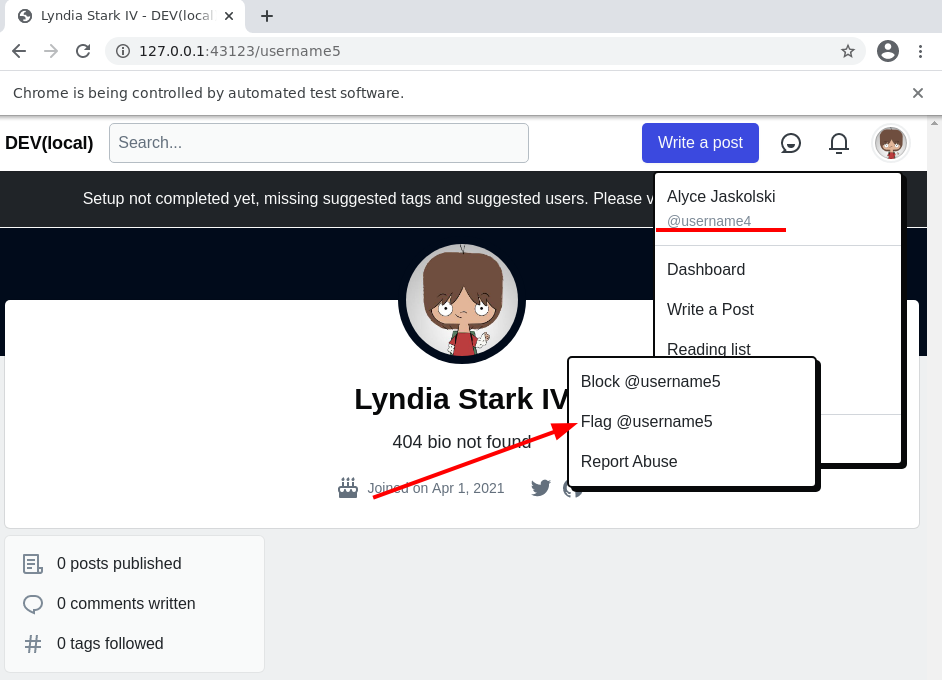
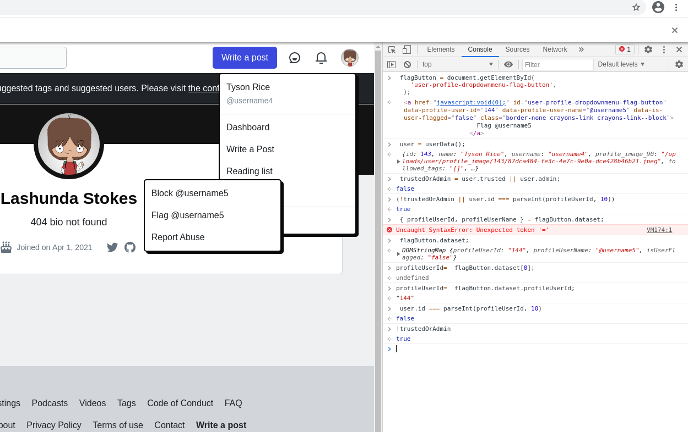
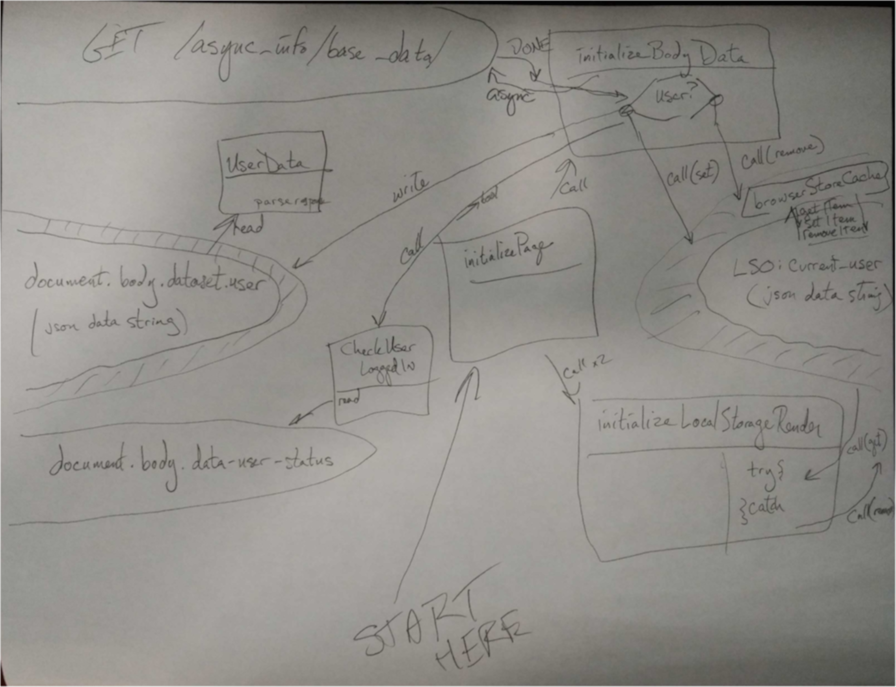

# userData is sometimes not loaded

Noticed this after [https://github.com/forem/forem/pull/12862/](https://github.com/forem/forem/pull/12862/files) was merged - and developers started reporting failures that they were sometimes able to replicate in isolation, sometimes not. Julianna was able to work around the failures she was seeing by adding a second page load in [https://github.com/forem/forem/pull/13224](https://github.com/forem/forem/pull/13224)

The rest of this page is describing how we got from failing test to "fixed" test, and what the next steps are - this will probably get distilled into a forem[ github issue](https://github.com/forem/forem/issues/13228) after I get my thoughts together here.

Actual problem is that a non-trusted user \(who should not show the Flag option in another user's profile page\) is in fact showing that the first time they visit the page.




### How did we get here

Internal forem team slack link [https://forem-team.slack.com/archives/C012YSX5ZC1/p1617289014004500](https://forem-team.slack.com/archives/C012YSX5ZC1/p1617289014004500) - but I'll distill what was useful from this discussion here since it's important background.

> Seeing a handful of failures related to `trsuted_user_flags_user_spec.rb` , specifically line 16: `when signed in as a non-trusted user, it does not show the flag button` . When I run the entire spec, the tests pass without an issue, but when I run just the specified test on its own, it fails with the same failures I’m seeing on Travis \(failure in thread\)

First thing I did was git blame on the file - it was just committed earlier that day \(about 7 hours before the report of the issue\) so that is a relief \(it's much more likely to be a problem with the test when it's a new test failing sometimes\). 

I checked out master and attempted to reproduce, but the spec passed for me. I know Forem's tests run sequentially/deterministically, so I added --random in order to see if sequencing would recreate the issue. A few random sorts \(there were only four tests in the file so if it will fail it will fail quickly\) down got me to a reproduction case:

```bash
bundle exec rspec spec/system/user/trusted_user_flags_user_spec.rb --order=random --seed=9374 --format=documentation
```

Julianna \(initial reporter\) tried adding a sign out to ensure state between runs was not being carried over. That "worked" the first time she tried it and stopped "fixing" this after a second run, but it was a valid attempt to isolate the two tests.

Capybara will snap a screenshot of the failing page when the expect fails, these go in tmp/screenshots/ and have a format that includes the spec's text description. I could see the wrong information \(the Flag item present on the page\) but not any more information than that.

I added the `HEADLESS=false` environment variable \([https://github.com/forem/forem/blob/master/spec/support/initializers/capybara.rb\#L14-L26](https://github.com/forem/forem/blob/master/spec/support/initializers/capybara.rb#L14-L26) checks for either a remote selenium url, or the HEADLESS environment variable, when configuring JS tests with capybara, basically the default is not to show the browser when the tests run, but you can change this when you call the test by passing in the right env var\). 

Unfortunately, this is really fast \(capybara reads the pages much faster than I do, the only delays are with chrome's rendering agent, which is also pretty fast\) - so in order to view the page I put a breakpoint in just before the `expect()` line in the failing spec \(I'm a firm believer in direct observation, which reduces the leverage a little and slows things down so I can explore the problem more\).

```ruby
  context "when signed in as a non-trusted user" do
    it "does not show the flag button" do
      sign_in create(:user)
      
      visit user_profile_path(user.username)
      click_button(id: "user-profile-dropdown")
      
      binding.pry # added in this step
      expect(page).not_to have_link(flag_text)
    end
  end
```

This permitted two things - the page stopped as the test was running leaving it up and inspectable, and the console popped open a debugger in the backend.

Since the code asserted that a "non-trusted" user was active, I looked at the page to get the current username \(top right dropdown\) and saw it was username4. I queried in the debugger what roles the user with that username had - and it came back empty - this is in fact a non-trusted user.

```ruby
User.find_by(username: :username4).roles
=> []
```

We spent some time looking at what controlled the display of the dropdown. There's a piece of code in the profile view that [adds the dropdown ](https://github.com/forem/forem/blob/master/app/views/users/show.html.erb#L35-L50)when a user is logged in \(rather than a crawler, for example\).

```ruby
              <div id="user-profile-dropdownmenu" class="crayons-dropdown top-100 right-0 p-1">
                <% if user_signed_in? %>
                  <a href="javascript:void(0);" id="user-profile-dropdownmenu-block-button" data-profile-user-id="<%= @user.id %>" class="border-none crayons-link crayons-link--block">Block @<%= @user.username %></a>
                  <a
                    href="javascript:void(0);"
                    id="user-profile-dropdownmenu-flag-button"
                    data-profile-user-id="<%= @user.id %>"
                    data-profile-user-name="@<%= @user.username %>"
                    data-is-user-flagged="<%= @is_user_flagged %>"
                    class="border-none crayons-link crayons-link--block">
                    <%= @flag_status ? "Unflag" : "Flag" %> @<%= @user.username %>
                  </a>
                  <%= javascript_packs_with_chunks_tag "profileDropdown", defer: true %>
                <% end %>
                <span class="report-abuse-link-wrapper" data-path="/report-abuse?url=<%= user_url(@user) %>"></span>
              </div>
```

It is useful to note that the user-profile-dropdownmenu-flag-button is included in the html response from user/show for all logged in users \(even non-trusted users\) - this suggests something is happening in the front end to alter the content of the dropdown menu on page load \(and changes the direction of the search\). As an aside, it would be possible, I think, to alter the code here and check the user's trusted role in the view at render time server side - very much like the `<% if user_signed_in? %>`check on the second line above. That could resolve the issue, at the expense of possibly adding an extra query at in the backend.

So what is the front end doing \(or not doing\) here? Also included in Michael's PR \(that added the tests that was failing\) is app/javascript/profileMenu/flagButton.js which handles the logic for display.

Notes on this file \(might be obvious to someone more conversant in javascript than I am\).

* there's a global function userData declared early in a comment
* The code here defines an exported function `initFlag()` \(which I assume is called elsewhere during initialization\) - if this is _not_ being called that could cause problems
* The first thing the function does is `getElementById` to find the `"user-profile-dropdownmenu-flag-button"` from the view, namign this `flagButton` 
* There's a guard in case that didn't exist \(if you can't see the flag, nothing to do, return early\).
* The second step is to load `userData()` into the const `user`
* If that's not present \(no user\) also exit early
* Otherwise, load the dataset from the `flagButton` to find the user id \(of the button, basically who would be flagged\) and whether they've already been flagged. The user name is also loaded to handle adapting the text later after actions \(when we send flag and unflag, what should the text show\).
* Check to  see if this user is trusted \(there are two keys checked, `user.trusted` and `user.admin`, either permits flagging other users\)
* If the user is not trusted, or if the flagButton is for the logged in user \(you would be flagging yourself, which doesn't make sense, or unflagging yourself, which is even worse\) -  `remove()` the flag button - it should only be visible for trusted users looking at other user's pages.

A little sleuthing confirmed that initFlag was being called but that user was not present \(`userData()` was null when initFlag was called\). By the time I had the inspector/console open on the page, `userData()` returned a nice hash of the user - with trusted false and admin false and all of the expected conditions in the proper states - such that calling initFlag\(\) at this point would have removed the item from the dropdown - but I think this is only invoked once and apparently it was invoked too early.



Mac added a \(new to me\) `debugger` statement to the function when he was testing

```javascript


  const user = userData();
  if (!user) {
    debugger
    return;
  }

```

I'm less clever, so instead added `console.log("User was null")` which might have been less useful but fit with my existing knowledge \(and TIL `debugger` in js does something useful\). In either case I was also getting the same result - initFlag is being called, userData return null. When \(above\) I tried to check userData interactively, I get a response back.

### Where am I now

1. I know initFlag is called
2. Sometimes userData is not ready and the flag is still shown
3. Refreshing the page \(or loading it a second time\) seems to fix this completely.

Possible fixes

* if user is not trusted, don't include the flag user button in the view \(move the logic server side into the view\)
* if user is null, they're probably not trusted, remove the flagButton \(add `flagButton.remove()` where the debugger statement is in the last snippet\).
* find out why userData is null when this is run but non-null \(valueful?\) later

[https://github.com/forem/forem/blob/master/app/javascript/onboarding/utilities.js\#L22-L32](https://github.com/forem/forem/blob/master/app/javascript/onboarding/utilities.js#L22-L32) defines this method, which looks for document.body.dataset. Since that's sometimes not available, it must be delivered from someplace other than the rendered page \(we don't seem to be injecting the dataset onto the body during page generation time for users, and must be accomplishing this through a mix of other methods during page rendering\) - that's an open item in my mind right now.

dataset.user is created during `initializeBodyData` which calls `fetchBaseData` [https://github.com/forem/forem/blob/master/app/assets/javascripts/initializers/initializeBodyData.js\#L11-L64](https://github.com/forem/forem/blob/master/app/assets/javascripts/initializers/initializeBodyData.js#L11-L64) Again with the "how to javascript" comments - the xmlhttp request \(configured based on browser capabilities\) object has an onreadystatechange property set to a lambda that fetches the `/async_info/base_data` url and parses to `json` - some csrf dance is done \(not relevant here\) and `document.body.dataset.loaded` is set to 'true' \(unconditionally, when we load the base data, we say  we have loaded it\). A check for broadcast \(not relevant\) is made and stored, and the user is checked.

If the user is present as a key in the json response, then the user key is added to the body's database \(we just copy whole from the json response onto the document\) - and set/stored in `browserStoreCache`

There's a setTimeout \(not sure  what's going on there, there's a `ga` call that looks unfamiliar/unclear to me right now\) that passes `'set', 'userId', a number parsed from json` to  `ga` - with 400ms timeout. 

If the user is not present as a key in the json response, the we clear user from the body.dataset if present, and call browserStoreCache with 'remove'. 

browserStoreCache is a function that takes args \( `'set', json.user` or `'remove'`\) so that's worth remembering.


Open questions: when is `initFlag` called, when is `body.dataset` populated, when is this async, and when is it automatic?

There's a second piece of the puzzle, called `initializeLocalStorageRender` that might be the key here, especially given that the test failure was order dependent.

```javascript
/* global initializeUserFollowButts */

function initializeLocalStorageRender() {
  try {
    var userData = browserStoreCache('get');
    if (userData) {
      document.body.dataset.user = userData;
      initializeBaseUserData();
      initializeReadingListIcons();
      initializeAllFollowButts();
      initializeUserFollowButts();
      initializeSponsorshipVisibility();
    }
  } catch (err) {
    browserStoreCache('remove');
  }
}

```

notable here - we ask if there is a `browserStoreCache`, call it `userData` and if it's loaded we inject user to `dataset.user` \(sounds like the thing I'm looking for\) and _also_ initialize base user data \(which loads more data from ajax and then overwrites the store cache with updated info, that's kind of a sync to local storage option?\) and update things based on things \(reading list, follows, etc\) but if it's not there \(local storage was null or failed?\) we remove the store cache \(why? what was in there?\). Importantly \(from my reading\) is that we're not attempting to load async the user data if it's not in storage, only to update the cached copy if it was. I'm not certain if this is a bug - if it is it looks like "when there's no browserStoreCache response, make an ajax request to create one" might be a reasonable solution.

Obvious take away is that _something else_ must be storing the `browserStoreCache` \(calling 'set'\) outside of this pair of initializers, and that might be slower for the first time a user logs in? If I'm piecing all the threads together right - that later \(during load\)/initial\(for this session\) storage process might be happening after any other code and particularly after the dropdown rendering was initialized. Secondary fuzzy thought is that `initializeBaseData` is always called but the async wait time for the xmlhttp response causes race conditions with rendering.

At this point in my thinking - the next steps could be to observe the race condition \(put a console.log with function name and timestamps in userData and in initFlag\) or keep digging around. I learned a few new words in the last snippet searches - namely `browserStoreCache` - and I'd like to exhaustively find out the places we're manipulating that \(while 'get' is interesting, 'set' and 'remove' seem critical\). From what I can see - the browserStoreCache always stores user data \(as a json string\) since there are no key names - only verbs - it's a singleton.

`initializeBaseData` sets the local store and probably has fewer callers, so I check for that first \(I don't use git grep like this - the command line is an artifact of calling from emacs using projectile-grep\):

```text
git --no-pager grep -n --color=auto -e initializeBaseUserData -- 
app/assets/javascripts/.eslintrc.js:25:    initializeBaseUserData: false,
app/assets/javascripts/initializePage.js:26:        initializeBaseUserData();
app/assets/javascripts/initializers/initializeBaseUserData.js:91:function initializeBaseUserData() {
app/assets/javascripts/initializers/initializeLocalStorageRender.js:8:      initializeBaseUserData();

```

The eslintrc is a static check config file and not code, it looks like [initializePage.js](https://github.com/forem/forem/blob/master/app/assets/javascripts/initializePage.js#L18-L39) was something I had not looked at yet and it calls on line 26 inside `callInitializers`, and also calls `initializeLocalStorageRender` first at line 88 [https://github.com/forem/forem/blob/master/app/assets/javascripts/initializePage.js\#L86-L90](https://github.com/forem/forem/blob/master/app/assets/javascripts/initializePage.js#L86-L90)


```javascript
function callInitializers() {
  initializeLocalStorageRender();
  initializeBodyData();

  var waitingForDataLoad = setInterval(function wait() {
    if (document.body.getAttribute('data-loaded') === 'true') {
      clearInterval(waitingForDataLoad);
      if (document.body.getAttribute('data-user-status') === 'logged-in') {
        initializeBaseUserData();
        initializeAllChatButtons();
        initializeAllTagEditButtons();
      }
      initializeBroadcast();
      initializeAllFollowButts();
      initializeUserFollowButts();
      initializeReadingListIcons();
      initializeSponsorshipVisibility();
      if (document.getElementById('sidebar-additional')) {
        document.getElementById('sidebar-additional').classList.add('showing');
      }
    }
  }, 1);

```


```javascript
function initializePage() {
  initializeLocalStorageRender();
  callInitializers();
}
```

a little weird - but initializeLocalStorageRender is called twice if we call initializePage \(once right away, second during callInitializers as the first thing we do\) - I can't see that being useful unless callInitializers is exported and called outside of initializePage - I'm beginning to  remember some "last method defined in a module is public" js hint I might have picked up a few years back.

In any case - it looks like "we setup local storage render" which removes browserStoreCache if it's not present, we do it again immediately after just in case, and then we call initializeBodyData which calls fetchBaseData which makes the ajax request and sets browserStoreCache when it's ready \(after the fetch\). I think I'm inches away from the race condition here. Might be time to switch to pen and paper, but before that - grep for browserStoreCache to see what/when that's called for update \(ignore get, find set and remove calls\).

```text

git --no-pager grep -n --color=auto -e browserStoreCache -- 
app/assets/javascripts/.eslintrc.js:24:    browserStoreCache: false,
app/assets/javascripts/initializers/initializeBodyData.js:44:        browserStoreCache('set', json.user);
app/assets/javascripts/initializers/initializeBodyData.js:53:        browserStoreCache('remove');
app/assets/javascripts/initializers/initializeLocalStorageRender.js:5:    var userData = browserStoreCache('get');
app/assets/javascripts/initializers/initializeLocalStorageRender.js:15:    browserStoreCache('remove');
app/assets/javascripts/utilities/browserStoreCache.js:3:function browserStoreCache(action, userData) {
app/assets/javascripts/utilities/browserStoreCache.js:21:      browserStoreCache('remove');

```

Fortunately - apart from the implementation and an eslintrc line, it sure looks like we've seen all that's going on here \(there isn't some hidden "other" action happening outside of the initializeLocalStorageRender and initializeBodyData that modifies this storage\).

The implementation \(not relevant\) just creates the action dispatch table and delegates behavior to localStorage in the browser:

```javascript
function browserStoreCache(action, userData) {
  try {
    switch (action) {
      case 'set':
        localStorage.setItem('current_user', userData);
        localStorage.setItem(
          'config_body_class',
          JSON.parse(userData).config_body_class,
        );
        break;
      case 'remove':
        localStorage.removeItem('current_user');
        break;
      default:
        return localStorage.getItem('current_user');
    }
  } catch (err) {
    if (navigator.cookieEnabled) {
      browserStoreCache('remove');
    }
  }
  return undefined;
}
```

So _now_ I think we can start at initializePage and make some decisions about what happens when a user signs in on the first page load, and how async update via ajax violates some assumptions we have in test, and why that causes a fresh sign in, followed by an immediate page view, to cause the issue we were seeing.


Last note - [https://docs.forem.com/frontend/plain-js/](https://docs.forem.com/frontend/plain-js/) describes the structure of the js in this project \(files in assets/javascript are served as scripts, plain, as-is, by sprockets, files in app/javascript/ are managed by webpack and bundled in application.js\) - worth a read if you are unfamiliar with it. It calls out initializePage as the main point of action driving loading.

### Draw it out when it's complicated


In an office environment this would be the time I move from my notes to a whiteboard/chalkboard. I'm going to just grab pen and paper instead.



My simplest description of the picture is there are three sources of data about users. The fastest is in the DOM \(right bubble\) but it's empty initially. The next fastest is LSO \(fast enough to be synchronous\) and it's used during page initialization to populate the DOM copy if present. The third, slowest, and necessarily asynchronous source is the Forem api via `/async_info/base_data`  but that doesn't set the DOM until it responds \(tens of milliseconds later\) and may be too late. However, as long as LSO is working \(which is normally true for logged in users\) this is a one-time cost on initial login.


What I think is happening

* no user was logged in - LSO is empty \(we ensure it's emptied during page setup\)
* user logs in but capybara immediately takes us to the new page \(bypassing normal redirect to / and subsequent JS execution that _would_ populate LSO so it's available early\)?
* When we view the next page, not having loaded /, we have an empty LSO - so browserStoreCache is clear\(ed\), so initializeBodyData starts an async network call \(returning early before the callback fires, and document.body.dataset.user is null, so userData is null\), and the page renders as though no user were logged in, and then the callback on base\_data's request fires, populating the dataset field, causing what I captured in the screenshot earlier \(all of the required variables that should have hidden the flag user item in the dropdown are present, but the flag user dropdown item was not hidden, and a reload of the page does work\).

### What next

So how do we improve this?

* add user information to the dom during page render \(basically inline the parts of the async call that are fast enough to be available, put them in the navbar when we render the user's icon link\) - this might be a performance issue but could provide more robust availability \(the backend knew the user was logged in\)
* Follow Nick's advice in the issue comment and wrap the logic to remove the dropdown in a wait for user ready \(currently in the chat utils so might need to be extracted/generalized\). 
* Change the test setup so that signin populates the LSO.

Opened a branch for this - [djuber/ensure-user-for-flag-button](https://github.com/forem/forem/tree/djuber/ensure-user-for-flag-button) and pushed it up \(currently only the "fix" Julianna added removed so I can confirm I have a failing test.\)


**Easy fix one** \(doesn't work, because now it breaks a different test\):

```javascript

modified   app/javascript/profileDropdown/flagButton.js
@@ -17,6 +17,7 @@ export function initFlag() {
 
   const user = userData();
   if (!user) {
+    flagButton.remove();
     return;
   }
 
```

Basically, this would fix the example that's failing, but changes the accidental pass when a user is logged in and trusted \(but that's the first exectued test, so LSO is cleared, or the order includes logged out, logged in as a trusted user expecting to see flag\). So let's revert this change and look for something "better" \(more reliable, and correct\).

I had expected this to be broken this way so didn't even list it.


[https://github.com/forem/forem/pull/13279](https://github.com/forem/forem/pull/13279) attempted to implement the solution Nick suggested \(wait for user data to be loaded before proceeeding\) - he gave very useful and detailed suggestions - and I stumbled through to a green build after some futzing around lint rules.

