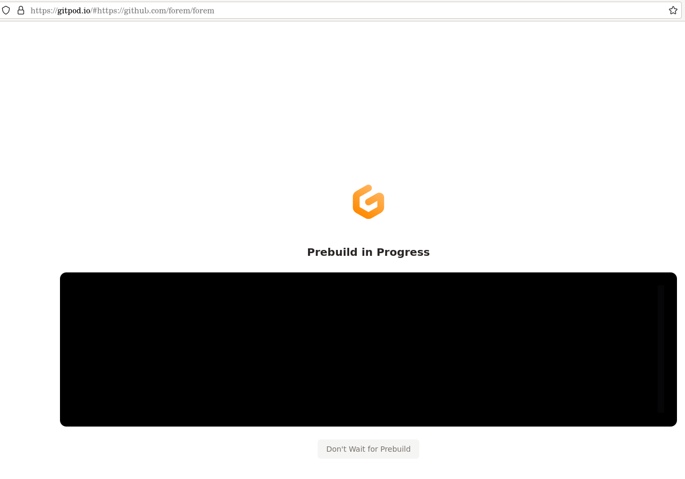
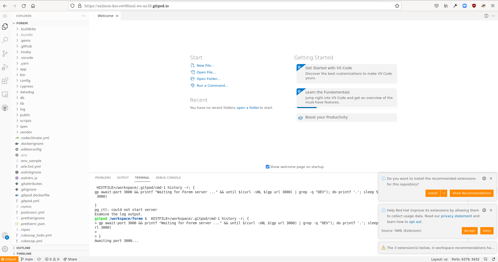
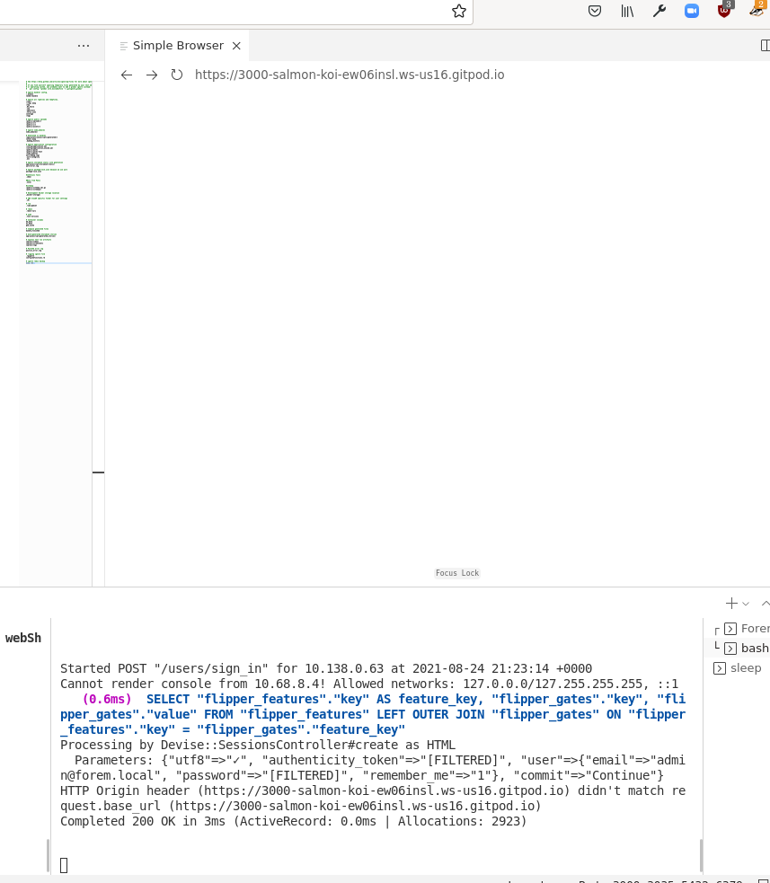
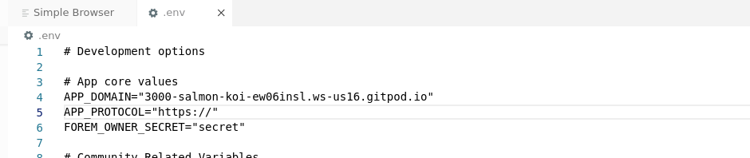
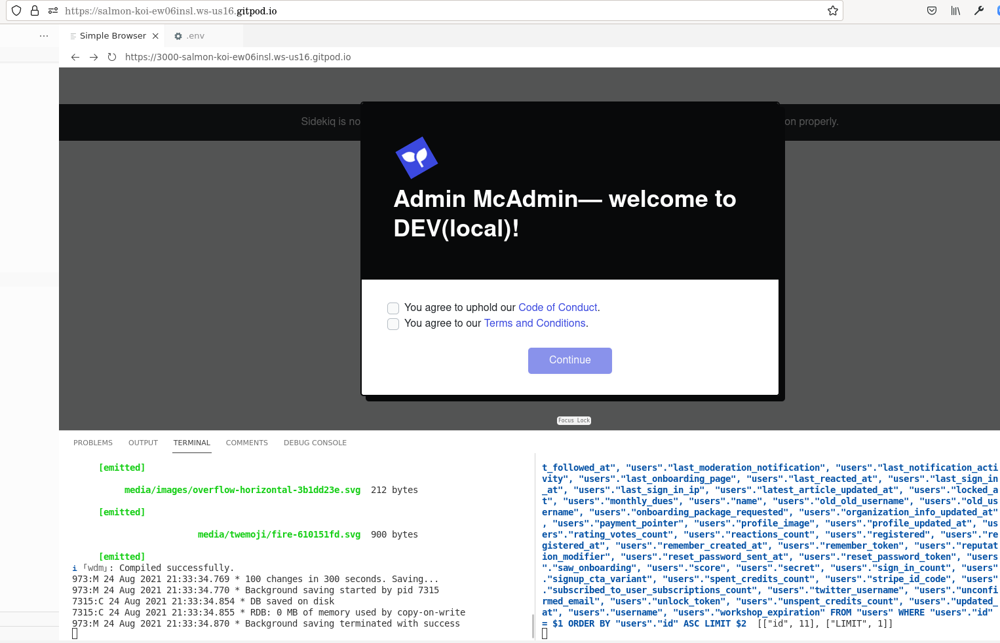

# gitpod development test

Key points learned: you might see issues with bin/startup - I'm not sure if foreman was even installed? You will have problems with browsing - you'll need to adjust the `APP_DOMAIN` and `APP_PROTOCOL` variables in the .env file to match gitpods environment \(mine was salmon-koi-ew06insl.ws-us16.gitpod.io/ but yours should be unique to you\) or you'll get a white screen due to unhandled CSRF mismatch when logging in.

----------------------------------------






Just on a lark I clicked the link in the install docs. I was prompted to sign in - I chose github - and I logged in pretty quickly.

Some notices about exposed ports being private by default \(good, I didn't think we wanted to host world-readable redis!\) and a theia editor being removed popped up - and I'm waiting on a prebuild now \(with an option to skip?\)




I opened the developer tools console to see what was happening \(the black box is supposed to be a log output\). There were some 404 errors being handled from the headless logs here 

```javascript
const retry = async (reason: string, err?: Error) => {
      console.debug("re-trying headless-logs because: " + reason, err);
      await new Promise((resolve) => {
        setTimeout(resolve, 2000);
      });
      startWatchingLogs().catch(console.error);
    };
```

```text
re-trying headless-logs because: error while listening to stream Error: Headless logs for 8fcda768-55ba-407b-8c42-5d261fa32fd5 not found
```

After 5 minutes I'm clicking "Dont wait for Prebuild" to see what happens next.

I get to "Creating" and pulling container image


Once it loads it appears you've got vscode in a browser \(think github codespaces, but 2 years ahead of them\) 



Not sure why pg\_ctl failed to start \(my assumption is the gitpod code might not be up to date with any other changes - looking into Ben's initial PR to see what he did to wire this up\)


Ah - there are two open terminals - one named "gp" \(gitpod?\) and the other for `Forem server: bash` 

  The bash terminal was the script starting forem \(including the seed script and db setup\) - the pg\_ctl failed issue appears to be benign as the seed is running correctly

It did take a few minutes for the bookkeeping to be done - I think maybe 20 minutes total before sidekiq and puma started.

Just like docker, after the seeds run - the sidekiq queue has a lot of creation callback work to process - so that's normal - the `gp` terminal changed to `sleep` once port 3000 was live.

In the meantime I was able to install the recommended extensions \(prettier, git, and ruby\) - there were some uninteresting extensions recommended for things like mdx files but I'm not sure what those are.


Since I never use vs-code I don't know what I'm doing - and the redis backup file dump.rdb is showing in the git unstaged area \(I'm not sure how to ignore it via the ui - the git extensions seem to support diff and commit but not managing the ignore file\) - if we're suggesting or expecting people to use this tool - adding the dump.rdb file to the gitignore would help avoid this.


Second time around I had a problem where redis complained about huge tables support in the kernel and refused to play nice - and foreman didn't start \(so port 3000 never came up\)

I manually started webpack dev server and rails s in two shells, but the "user login doesn't work because of csrf and the app domain conflict" - white screen after login error \(this happens in a _lot_ of situations like docker and sometimes other proxied connections\). 

```text
Processing by Devise::SessionsController#create as HTML Parameters: {"utf8"=>"✓", "authenticity_token"=>"[FILTERED]", "user"=>{"email"=>"admin@forem.local", "password"=>"[FILTERED]", "remember_me"=>"1"}, "commit"=>"Continue"} HTTP Origin header (
https://3000-salmon-koi-ew06insl.ws-us16.gitpod.io
) didn't match request.base_url (
https://3000-salmon-koi-ew06insl.ws-us16.gitpod.io
) Completed 200 OK in 3ms (ActiveRecord: 0.0ms | Allocations: 1935)
```



Since I seem to remember the problem here beeing with appdomain and app protocol - I edited those in the .env file to match the sent version in the error - and restarted rails. This permitted me to log in successfully:






Preview of forem.dev post [https://forem.dev/djuber/using-gitpod-5ebk-temp-slug-6374097?preview=1a13e7dd684cf51b0a05c729eb7c8c73cc573d30ab1315f5eacf2bf017663d6749beefeb1f5b950b9e8e21e1368a924d35fe7611a735ead795abe137](https://forem.dev/djuber/using-gitpod-5ebk-temp-slug-6374097?preview=1a13e7dd684cf51b0a05c729eb7c8c73cc573d30ab1315f5eacf2bf017663d6749beefeb1f5b950b9e8e21e1368a924d35fe7611a735ead795abe137) in progress

