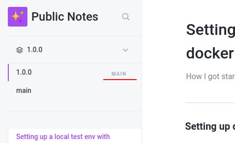
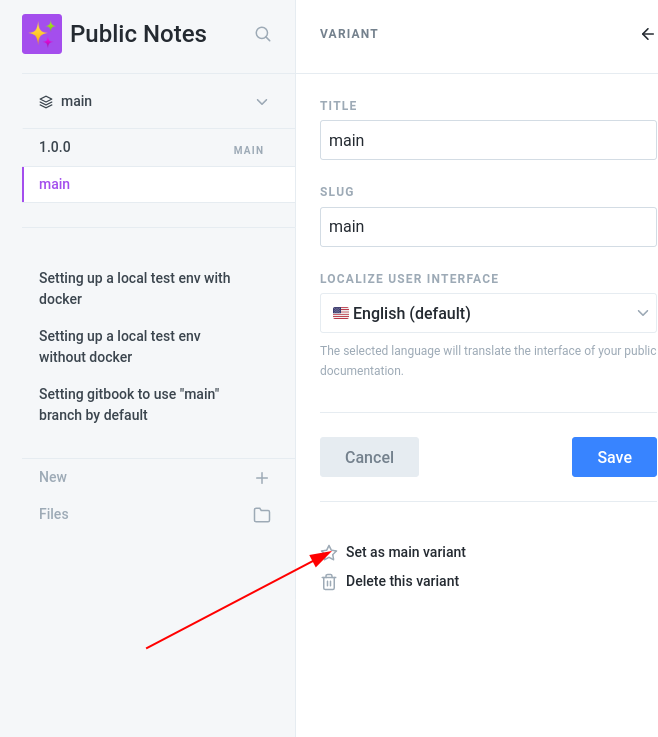

# Setting gitbook to use "main" branch by default

Gitbook, by default, when you integrate with github, will push to master. 

Github, by default, will set main as the  default branch \(for cloned repos this is the first checked out branch, and for pull requests this is the default merge target\). 

It makes sense to have these speak the same language. One option is to change the default branch \(in github, under repo settings, branches, chose "Default Branch" using the pencil icon next to main\). The other is to point gitbook at main instead of master.

Under "Integrations" in the left side, setup github. When prompted for branches the default is master only, but we can add "main" on the right option. When you enable this gitbook will sync to github both on the main branch \(where it creates a new empty "variant" with no content and an empty readme\) and master \(not what we wanted, but if you have content this is where it went, we'll fix that in a moment\).

On the left side where the space name is shown, the default variant \(for me this said "1.0.0" is just under the space name, and a right arrow drop down is available\)

Click on main and select the `...` ellipsis icon

I think "title" is what's presented in gitbook, and "slug" is the branch name in github. Save after selecting the star.

If all your content disappears here, it's because gitbook just synced from the empty main variant. Open a PR and merge master into main  and all should be well.

