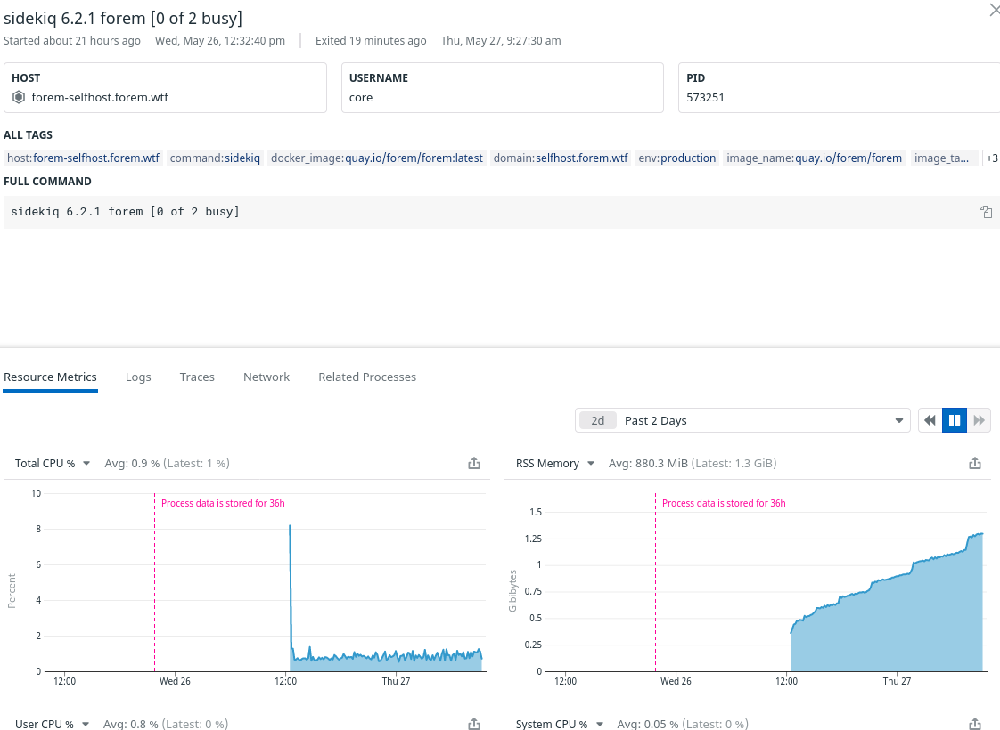
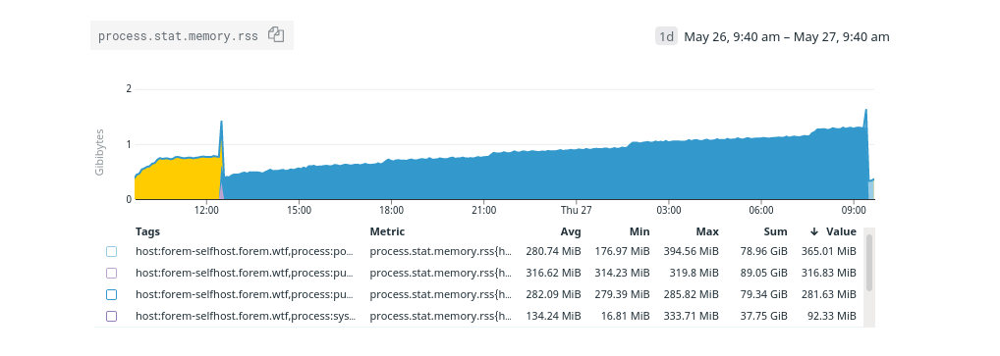

# Sidekiq Memory Use



We have noticed a number of memory issues with the self-hosted forem test instance \(a 4GB digital ocean droplet\). Initially the assumption was the pressure was coming from ElasticSearch \(which is a fairly heavyweight process sitting on the jvm, a cost we couldn't spread to other components since the ruby stack is not using jruby\). ES had been removed but the OOM lockups on the test instance continued.


Joe was able to install datadog monitoring in the pod so we could get a view of memory use \(identify the problem service\) - it turned out to consistently be sidekiq.

I attempted to disable the ActiveRecord cache for sidekiq and we let the process run for a day - the results were disappointing.



Strangely - there's little to no correlation between the "steps" up in the graph and running jobs - when I zoom in closer \(1h scale\) the step is actually just a larger hump in what looks like a sawtooth function, with the troughs coming 100MB higher than before after the process.

Another look at sidekiq \(showing restarts both yesterday and today\)



I dumped the service logs for a relevant timespan - the sidekiq allocations during an extended period make little to no sense \(this is a quiet instance, there's only the scheduled jobs, they all complete in under 2 seconds\).

Possible suspicions:

could fog be allocating and not releasing something when we \(fail\) to create the sitemap \(issue is aws config is required but not present\)

could something with unique job or another sidekiq middleware/plugin unrelated to any job be allocating regularly? 

What's next?


## Is there a job responsible?

Rhymes suggested running the scheduled jobs one by one to see if there's a link between growth over time and some particular job \(by disabling all scheduled jobs but one, one by one\).

I'm more inclined to run the same jobs 1000 times in a row repeatedly to track that...


```ruby
schedule = YAML.load(File.open("config/schedule.yml"))

schedule.map {|j| j.second.slice("class", "args") }=> [{"class"=>"Feeds::ImportArticlesWorker"},                      
 {"class"=>"Metrics::RecordBackgroundQueueStatsWorker"},
 {"class"=>"Metrics::RecordDailyUsageWorker"},
 {"class"=>"Metrics::RecordDailyNotificationsWorker"},
 {"class"=>"Metrics::RecordDataCountsWorker"},
 {"class"=>"Metrics::CheckDataUpdateScriptStatuses"},
 {"class"=>"BadgeAchievements::BadgeAwardWorker", "args"=>["", "award_yearly_club", ""]},
 {"class"=>"BadgeAchievements::BadgeAwardWorker", "args"=>["", "award_beloved_comment", ""]},
 {"class"=>"BadgeAchievements::BadgeAwardWorker", "args"=>["", "award_four_week_streak", ""]},
 {"class"=>"BadgeAchievements::BadgeAwardWorker", "args"=>["", "award_eight_week_streak", ""]},
 {"class"=>"BadgeAchievements::BadgeAwardWorker", "args"=>["", "award_sixteen_week_streak", ""]},
 {"class"=>"BadgeAchievements::BadgeAwardWorker", "args"=>["", "award_tag", ""]},
 {"class"=>"BadgeAchievements::BadgeAwardWorker", "args"=>["", "award_contributor_from_github", ""]},
 {"class"=>"HtmlVariants::RemoveOldDataWorker"},
 {"class"=>"Tags::ResaveSupportedTagsWorker"},
 {"class"=>"Listings::ExpireOldListingsWorker"},
 {"class"=>"Broadcasts::SendWelcomeNotificationsWorker"},
 {"class"=>"SitemapRefreshWorker"},
 {"class"=>"BustCachePathWorker", "args"=>["/feed.xml"]},
 {"class"=>"BustCachePathWorker", "args"=>["/badge"]},
 {"class"=>"BustCachePathWorker", "args"=>["/"]},
 {"class"=>"Emails::EnqueueDigestWorker"},
 {"class"=>"Notifications::RemoveOldNotificationsWorker"},
 {"class"=>"Credits::SyncCounterCache"},
 {"class"=>"Podcasts::EnqueueGetEpisodesWorker"},
 {"class"=>"GithubRepos::UpdateLatestWorker"},
 {"class"=>"PushNotifications::CleanupWorker"}]
```

The badge award worker takes 3 positional args usernames, badge\_slug, and message, so that's why passing the slug alone requires two empty string args as well.

