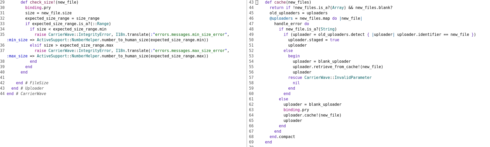

# Reapproach quay containers

Jotting down a few notes before I get started. Talked earlier this week with Joe about how they overcame volume mount and user permissions issues for the forem self-host instances \(Digital ocean droplet running podman running thes quay.io/forem/forem:latest image plus supporting services\).


"quay containers" is a horrible name for this - what I mean are the containers I can download now from quay.io/forem/forem that are built and tagged by buildkite both during PR branches and master builds. This is important because these are also the containers we deploy \(in forem cloud, and likely in self-hosting\). S


One thing that needed/needs to happen is removing the root user and using the forem user \(sounds like a docker-compose change- the container file already builds a forem user, we weren't using that\). - Snapped this commit together during the discussion [https://github.com/djuber/forem/commit/36dc3c56a1f18351983bd038f28e49c60ff016be](https://github.com/djuber/forem/commit/36dc3c56a1f18351983bd038f28e49c60ff016be)

My last series of tests would copy the tree into the image during build \(so any code changes locally required a rebuild of the image, which wasn't a problem as long as just running the container was the task at hand, but could be a big hassle for live use/reuse\).

My problems with port vs expose are still valid \(I think I want to change to expose basically for everything in testing - unless there's value in seeing port 3000 I shouldn't _need_ to stop the local dev env to interact with docker\). 

How do I isolate the "testing" stage in the container file?

```text
docker build --target="testing" . 
```

I think this might be correct.

Change 1:

make the entrypoint call rspec instead of rails server - I remember this being a weird decision when I was using docker compose to run the tests because of how the output happened

```text

-CMD ["bundle", "exec", "rails", "server", "-b", "0.0.0.0", "-p", "3000"]
+CMD ["bundle", "exec", "rspec"]
 
```

Did some minor surgery on the test compose file and I'm able to get errors running tests now successfully



Commented out the profile image from the users factory and I'm down to a few hundred failures \(out of 6000\) so \(1\) carrierwave is still an impediment, mostly tied to user factory, \(2\) it's the main problem to solve here.

```text
$ docker-compose -f test-compose.yml run rails bundle exec rspec --format=documentation

```

My next step will be to add a single carrierwave test case "it saves profile images" and assert I can do that - and use that as the indicator for testing.


In the meantime - with just a comment on the profile image attribute in the users factory - I can get the specs to run more or less \(some other attached images fail, a few tests actually act on it, there are other problems\) - but we're looking at a few hundred rather than four thousand failures \(when `create(:user)` fails lots of scenarios go belly up\). 

```text
Finished in 13 minutes 3 seconds (files took 7.42 seconds to load)
6030 examples, 965 failures, 28 pending
```

Apart from carrierwave - the same issue as earlier \(chrome binary not present in the image\) presents - we may want to filter out feature tests and run them separately anyway?

```ruby
  describe "profile_image" do
    let(:image_path) { Rails.root.join("spec/support/fixtures/images/image1.jpeg") }
    let(:user) { create(:user) }

    it 'has a profile image' do
      user.profile_image = Rack::Test::UploadedFile.new(image_path, "image/jpeg")
      expect(user.valid?).to be true
    end
  end

```

This fails \(for the same reason you would expect - the `profile_image` is `#<ProfileImageUploader:0x00007f076ab798f0 @model=#<User id: 13362, apple_created_at: nil, apple_usern...=nil, @cache_id=nil, @identifier=nil, @versions=nil, @versions_to_cache=nil, @versions_to_store=nil>` and that's not valid \(image is nil, so image type is nil\)


Suddenly started seeing issues with module autoloading around Notifications \(which makes far less sense as a problem\).


### Part 2

I had some time to reapproach this today. As an experiment, I first tried changing the volume: to a mount: \(bind mount\) by updating the docker compose file. This seems like it was a dead end \(worthwhile experiment, but possibly unimportant\).


Second experiment was to change the `Rack::Test::UploadedFile.new` calls in the factories to `File.open()` calls. This appears to have worked \(notably, I don't see a /tmp file created by rack, and _do_ see the file in `public/uploads/users/profile_image/userid` but this feels like I've sidestepped the issue rather than understanding it.


### Part 3

I'm going to just throw this week at the problem

I removed the edit to the users factory \(restoring the original rack test uploaded file image\).

User.new\(profile\_image: Rack::Test::UploadedFile\) creates a new tempfile per user \(i.e. I pass in an uploaded file that has a tmpfile already, during processing - before anything goes into the upload directory - another tempfile is created - user model fails validation \(initial error was wrong mime type - but removing the minimagick include from base uploader causes the error to change to "must be at least 1 byte" and the `profile_image` has no associated file:

```ruby
image_path = Rails.root.join("spec/support/fixtures/images/image1.jpeg")                                                               
=> #<Pathname:/opt/apps/forem/spec/support/fixtures/images/image1.jpeg>

profile_image = Rack::Test::UploadedFile.new(image_path, "image/jpeg")                                                                           
=> #<Rack::Test::UploadedFile:0x00007f3528912c88
 @content_type="image/jpeg",
 @original_filename="image1.jpeg",
 @tempfile=#<File:/tmp/image120210511-18-ssk9ua.jpeg>>

user = User.new(
  name: Faker::Name.name,
  email: Faker::Internet.email,      
  username: "User0001",              
  profile_image: Rack::Test::UploadedFile.new(Rails.root.join("spec/support/fixtures/images/image1.jpeg"), "image/jpeg"),                                   
  confirmed_at: Time.now,      
  saw_onboarding: true,        
  checked_code_of_conduct: true,      
  registered_at: Time.now)              
=> #<User id: nil, apple_username: nil, articles_count: 0, badge_achievements_count: 0, blocked_by_count: 0, blocking_others_count: 0, checked_code_of_conduct: true, checked_terms_and_conditions: false, comments_count: 0, config_font: "default", config_navbar: "default", config_theme: "default", created_at: nil, credits_count: 0, display_announcements: true, display_sponsors: true, editor_version: "v1", email: "agustin@skiles-hand.biz", email_badge_notifications: true, email_comment_notifications: true, email_community_mod_newsletter: false, email_connect_messages: true, email_digest_periodic: false, email_follower_notifications: true, email_membership_newsletter: false, email_mention_notifications: true, email_newsletter: false, email_tag_mod_newsletter: false, email_unread_notifications: true, experience_level: nil, export_requested: false, exported_at: nil, facebook_username: nil, feed_fetched_at: "2017-01-01 00:00:00.000000000 -0500", feed_mark_canonical: false, feed_referential_link: true, feed_url: nil, following_orgs_count: 0, following_tags_count: 0, following_users_count: 0, github_repos_updated_at: "2017-01-01 00:00:00.000000000 -0500", github_username: nil, inbox_guidelines: nil, inbox_type: "private", last_article_at: "2017-01-01 00:00:00.000000000 -0500", last_comment_at: "2017-01-01 00:00:00.000000000 -0500", last_followed_at: nil, last_moderation_notification: "2017-01-01 00:00:00.000000000 -0500", last_notification_activity: nil, last_onboarding_page: nil, last_reacted_at: nil, latest_article_updated_at: nil, mobile_comment_notifications: true, mod_roundrobin_notifications: true, monthly_dues: 0, name: "Miss Wilmer Stokes", old_old_username: nil, old_username: nil, onboarding_package_requested: false, organization_info_updated_at: nil, payment_pointer: nil, permit_adjacent_sponsors: true, profile_image: nil, profile_updated_at: "2017-01-01 00:00:00.000000000 -0500", rating_votes_count: 0, reaction_notifications: true, reactions_count: 0, registered: true, registered_at: "2021-05-11 10:51:35.331809736 -0400", reputation_modifier: 1.0, saw_onboarding: true, score: 0, secret: nil, signup_cta_variant: nil, spent_credits_count: 0, stripe_id_code: nil, subscribed_to_user_subscriptions_count: 0, twitter_username: nil, unspent_credits_count: 0, updated_at: nil, username: "User0001", welcome_notifications: true, workshop_expiration: nil>

user.valid?                                                                                                                                                                                                               
=> false
user.errors.messages                                      
=> {:profile_image=>["File size should be greater than 1 Byte"]}      

user.profile_image                                                                                       
=> #<ProfileImageUploader:0x00007f3524f9ed08
 @cache_id=nil,
 @file=nil,
 @filename=nil,
 @identifier=nil,
 @model=
  #<User id: nil, apple_username: nil, articles_count: 0, badge_achievements_count: 0, blocked_by_count: 0, blocking_others_count: 0, checked_code_of_conduct: true, checked_terms_and_conditions: false, comments_count: 0, config_font: "default", config_navbar: "default", config_theme: "default", created_at: nil, credits_count: 0, display_announcements: true, display_sponsors: true, editor_version: "v1", email: "agustin@skiles-hand.biz", email_badge_notifications: true, email_comment_notifications: true, email_community_mod_newsletter: false, email_connect_messages: true, email_digest_periodic: false, email_follower_notifications: true, email_membership_newsletter: false, email_mention_notifications: true, email_newsletter: false, email_tag_mod_newsletter: false, email_unread_notifications: true, experience_level: nil, export_requested: false, exported_at: nil, facebook_username: nil, feed_fetched_at: "2017-01-01 00:00:00.000000000 -0500", feed_mark_canonical: false, feed_referential_link: true, feed_url: nil, following_orgs_count: 0, following_tags_count: 0, following_users_count: 0, github_repos_updated_at: "2017-01-01 00:00:00.000000000 -0500", github_username: nil, inbox_guidelines: nil, inbox_type: "private", last_article_at: "2017-01-01 00:00:00.000000000 -0500", last_comment_at: "2017-01-01 00:00:00.000000000 -0500", last_followed_at: nil, last_moderation_notification: "2017-01-01 00:00:00.000000000 -0500", last_notification_activity: nil, last_onboarding_page: nil, last_reacted_at: nil, latest_article_updated_at: nil, mobile_comment_notifications: true, mod_roundrobin_notifications: true, monthly_dues: 0, name: "Miss Wilmer Stokes", old_old_username: nil, old_username: nil, onboarding_package_requested: false, organization_info_updated_at: nil, payment_pointer: nil, permit_adjacent_sponsors: true, profile_image: nil, profile_updated_at: "2017-01-01 00:00:00.000000000 -0500", rating_votes_count: 0, reaction_notifications: true, reactions_count: 0, registered: true, registered_at: "2021-05-11 10:51:35.331809736 -0400", reputation_modifier: 1.0, saw_onboarding: true, score: 0, secret: nil, signup_cta_variant: nil, spent_credits_count: 0, stripe_id_code: nil, subscribed_to_user_subscriptions_count: 0, twitter_username: nil, unspent_credits_count: 0, updated_at: nil, username: "user0001", welcome_notifications: true, workshop_expiration: nil>,
 @mounted_as=:profile_image,
 @staged=false,
 @versions=nil,
 @versions_to_cache=nil,
 @versions_to_store=nil>
 
 
```

Works fine when I pass in an open file object

```ruby
 user = User.new(
   name: Faker::Name.name,
   email: Faker::Internet.email,      
   username: "User0001",      
   profile_image: File.open(image_path) )
=> #<User id: nil, apple_username: nil, articles_count: 0, badge_achievements_count: 0, blocked_by_count: 0, blocking_others_count: 0, checked_code_of_conduct: false, checked_terms_and_conditions: false, comments_count: 0, config_font: "default", config_navbar: "default", config_theme: "default", created_at: nil, credits_count: 0, display_announcements: true, display_sponsors: true, editor_version: "v1", email: "joel_deckow@nicolas.io", email_badge_notifications: true, email_comment_notifications: true, email_community_mod_newsletter: false, email_connect_messages: true, email_digest_periodic: false, email_follower_notifications: true, email_membership_newsletter: false, email_mention_notifications: true, email_newsletter: false, email_tag_mod_newsletter: false, email_unread_notifications: true, experience_level: nil, export_requested: false, exported_at: nil, facebook_username: nil, feed_fetched_at: "2017-01-01 00:00:00.000000000 -0500", feed_mark_canonical: false, feed_referential_link: true, feed_url: nil, following_orgs_count: 0, following_tags_count: 0, following_users_count: 0, github_repos_updated_at: "2017-01-01 00:00:00.000000000 -0500", github_username: nil, inbox_guidelines: nil, inbox_type: "private", last_article_at: "2017-01-01 00:00:00.000000000 -0500", last_comment_at: "2017-01-01 00:00:00.000000000 -0500", last_followed_at: nil, last_moderation_notification: "2017-01-01 00:00:00.000000000 -0500", last_notification_activity: nil, last_onboarding_page: nil, last_reacted_at: nil, latest_article_updated_at: nil, mobile_comment_notifications: true, mod_roundrobin_notifications: true, monthly_dues: 0, name: "Pres. Janette D'Amore", old_old_username: nil, old_username: nil, onboarding_package_requested: false, organization_info_updated_at: nil, payment_pointer: nil, permit_adjacent_sponsors: true, profile_image: nil, profile_updated_at: "2017-01-01 00:00:00.000000000 -0500", rating_votes_count: 0, reaction_notifications: true, reactions_count: 0, registered: true, registered_at: nil, reputation_modifier: 1.0, saw_onboarding: true, score: 0, secret: nil, signup_cta_variant: nil, spent_credits_count: 0, stripe_id_code: nil, subscribed_to_user_subscriptions_count: 0, twitter_username: nil, unspent_credits_count: 0, updated_at: nil, username: "User0001", welcome_notifications: true, workshop_expiration: nil>

user.valid?
=> true

user.profile_image
=> #<ProfileImageUploader:0x00007f3524dd1f98
 @cache_id="1620745833-202884052316791-0002-6862",
 @cache_storage=
  #<CarrierWave::Storage::File:0x00007f35237a63b8
   @cache_called=nil,
   @uploader=#<ProfileImageUploader:0x00007f3524dd1f98 ...>>,
 @file=
  #<CarrierWave::SanitizedFile:0x00007f3524dd0af8
   @content=nil,
   @content_type="image/jpeg",
   @file="/opt/apps/forem/public/uploads/tmp/1620745833-202884052316791-0002-6862/image1.jpeg",
   @original_filename="image1.jpeg">,
 @filename="image1.jpeg",
 @identifier=nil,
 @model=
  #<User id: nil, apple_username: nil, articles_count: 0, badge_achievements_count: 0, blocked_by_count: 0, blocking_others_count: 0, checked_code_of_conduct: false, checked_terms_and_conditions: false, comments_count: 0, config_font: "default", config_navbar: "default", config_theme: "default", created_at: nil, credits_count: 0, display_announcements: true, display_sponsors: true, editor_version: "v1", email: "joel_deckow@nicolas.io", email_badge_notifications: true, email_comment_notifications: true, email_community_mod_newsletter: false, email_connect_messages: true, email_digest_periodic: false, email_follower_notifications: true, email_membership_newsletter: false, email_mention_notifications: true, email_newsletter: false, email_tag_mod_newsletter: false, email_unread_notifications: true, experience_level: nil, export_requested: false, exported_at: nil, facebook_username: nil, feed_fetched_at: "2017-01-01 00:00:00.000000000 -0500", feed_mark_canonical: false, feed_referential_link: true, feed_url: nil, following_orgs_count: 0, following_tags_count: 0, following_users_count: 0, github_repos_updated_at: "2017-01-01 00:00:00.000000000 -0500", github_username: nil, inbox_guidelines: nil, inbox_type: "private", last_article_at: "2017-01-01 00:00:00.000000000 -0500", last_comment_at: "2017-01-01 00:00:00.000000000 -0500", last_followed_at: nil, last_moderation_notification: "2017-01-01 00:00:00.000000000 -0500", last_notification_activity: nil, last_onboarding_page: nil, last_reacted_at: nil, latest_article_updated_at: nil, mobile_comment_notifications: true, mod_roundrobin_notifications: true, monthly_dues: 0, name: "Pres. Janette D'Amore", old_old_username: nil, old_username: nil, onboarding_package_requested: false, organization_info_updated_at: nil, payment_pointer: nil, permit_adjacent_sponsors: true, profile_image: nil, profile_updated_at: "2017-01-01 00:00:00.000000000 -0500", rating_votes_count: 0, reaction_notifications: true, reactions_count: 0, registered: true, registered_at: nil, reputation_modifier: 1.0, saw_onboarding: true, score: 0, secret: nil, signup_cta_variant: nil, spent_credits_count: 0, stripe_id_code: nil, subscribed_to_user_subscriptions_count: 0, twitter_username: nil, unspent_credits_count: 0, updated_at: nil, username: "user0001", welcome_notifications: true, workshop_expiration: nil>,
 @mounted_as=:profile_image,
 @original_filename="image1.jpeg",
 @staged=true,
 @versions={},
 @versions_to_cache=nil,
 @versions_to_store=nil>
```

This also worked fine on Debian \(when I built the app container from rails instead of the forem image\) - so I suspect there's something either with /tmp or /opt/apps/forem/ tied to selinux or some other fedora core specific item.


Let's try to see what the profile image uploader is doing:

```ruby

class Interceptor
  def initialize(delegate)
    @delegate = delegate
  end

  def method_missing(method_name, *args, &block)
    puts [method_name, args].inspect

    @delegate.send(method_name, args, &block)
  end
end

profile_image = Interceptor.new(File.open(image_path))

user = User.new(
		name: Faker::Name.name,
		      email: Faker::Internet.email,
		      username: "User0001",
		      profile_image: profile_image,
		      confirmed_at: Time.now,
		      saw_onboarding: true,
		      checked_code_of_conduct: true,
		      registered_at: Time.now)

```

This doesn't hit the method missing block to puts anything - and trying to use TracePoint didn't log anything until I exited the breakpoint and rspec continued.


I put a breakpoint in check\_size \(in CarrierWave::Uploader::FileSize - since that's one of the validations that's failing\) and wanted to look at `new_file`and see what was happening.

In the never ending shuffle of content from /tmp to /tmp to public/tmp/ to public/uploads/user/profile\_image it looks like there's also a step through tmp/

```ruby
[1] pry(#<RSpec::ExampleGroups::User::Profiles>)> 

From: /opt/apps/forem/vendor/bundle/ruby/2.7.0/gems/carrierwave-2.2.1/lib/carrierwave/uploader/file_size.rb:31 CarrierWave::Uploader::FileSize#check_size!:

    29: def check_size!(new_file)
    30:   binding.pry
 => 31:   size = new_file.size
    32:   expected_size_range = size_range
    33:   if expected_size_range.is_a?(::Range)
    34:     if size < expected_size_range.min
    35:       raise CarrierWave::IntegrityError, I18n.translate(:"errors.messages.min_size_error", :min_size => ActiveSupport::NumberHelper.number_to_human_size(expected_size_range.min))                 
    36:     elsif size > expected_size_range.max
    37:       raise CarrierWave::IntegrityError, I18n.translate(:"errors.messages.max_size_error", :max_size => ActiveSupport::NumberHelper.number_to_human_size(expected_size_range.max))                 
    38:     end
    39:   end
    40: end

[1] pry(#<ProfileImageUploader>)> new_file
=> #<CarrierWave::SanitizedFile:0x00007f619c4cf3b0
 @content=nil,
 @content_type="image/jpeg",
 @file="/opt/apps/forem/tmp/1620758519-863715365372413-0001-2311/image1.jpeg",
 @original_filename=nil>
 [2] pry(#<ProfileImageUploader>)> new_file.size
=> 0                                     

# self here - since this is a module - is ProfileImageUploader where original_filename is image1.jpeg and cache_id is the path to the file
```

Somehow _this_ file is being created, assigned to the upload, but it is empty. Having no content in the created file sure sounds like it could _also_ cause issues with validating the content type is allowed.


Copying the content of the jpeg from /tmp into the jpeg in tmp/ does cause the test to pass:

```ruby
File.open(new_file.file, 'wb') do |file|
  file.write(File.read("/tmp/image120210511-17-z5wwpm.jpeg"))  
end                                                            
=> 14946                               

new_file.size
=> 14946                                       
.

Finished in 3 minutes 16.1 seconds (files took 2.99 seconds to load)
1 example, 0 failures
```

Since there's something going wrong _before_ this is happening, let's capture the context and figure out where to look upstream

```ruby
# raise an error just to get the backtrace - 
# is there a smarter way to get this from the current execution context?

begin
  raise StandardError
rescue StandardError => e  
  puts e.backtrace         
  e             
end  
(pry):3:in `check_size!'               
# ... a bunch of lines saying I was in a pry repl when I wrote that code
/opt/apps/forem/vendor/bundle/ruby/2.7.0/gems/carrierwave-2.2.1/lib/carrierwave/uploader/file_size.rb:31:in `check_size!'
/opt/apps/forem/vendor/bundle/ruby/2.7.0/gems/carrierwave-2.2.1/lib/carrierwave/uploader/callbacks.rb:14:in `block in with_callbacks'
/opt/apps/forem/vendor/bundle/ruby/2.7.0/gems/carrierwave-2.2.1/lib/carrierwave/uploader/callbacks.rb:14:in `each'
/opt/apps/forem/vendor/bundle/ruby/2.7.0/gems/carrierwave-2.2.1/lib/carrierwave/uploader/callbacks.rb:14:in `with_callbacks'
/opt/apps/forem/vendor/bundle/ruby/2.7.0/gems/carrierwave-2.2.1/lib/carrierwave/uploader/cache.rb:144:in `cache!'
/opt/apps/forem/vendor/bundle/ruby/2.7.0/gems/carrierwave-2.2.1/lib/carrierwave/mounter.rb:63:in `block (2 levels) in cache'
/opt/apps/forem/vendor/bundle/ruby/2.7.0/gems/carrierwave-2.2.1/lib/carrierwave/mounter.rb:176:in `handle_error'
/opt/apps/forem/vendor/bundle/ruby/2.7.0/gems/carrierwave-2.2.1/lib/carrierwave/mounter.rb:47:in `block in cache'
/opt/apps/forem/vendor/bundle/ruby/2.7.0/gems/carrierwave-2.2.1/lib/carrierwave/mounter.rb:46:in `map'
/opt/apps/forem/vendor/bundle/ruby/2.7.0/gems/carrierwave-2.2.1/lib/carrierwave/mounter.rb:46:in `cache'
/opt/apps/forem/vendor/bundle/ruby/2.7.0/gems/carrierwave-2.2.1/lib/carrierwave/mount.rb:146:in `profile_image='
/opt/apps/forem/vendor/bundle/ruby/2.7.0/gems/carrierwave-2.2.1/lib/carrierwave/mount.rb:373:in `profile_image='
/opt/apps/forem/vendor/bundle/ruby/2.7.0/gems/carrierwave-2.2.1/lib/carrierwave/orm/activerecord.rb:75:in `profile_image='
/opt/apps/forem/vendor/bundle/ruby/2.7.0/gems/factory_bot-6.1.0/lib/factory_bot/attribute_assigner.rb:16:in `public_send'
/opt/apps/forem/vendor/bundle/ruby/2.7.0/gems/factory_bot-6.1.0/lib/factory_bot/attribute_assigner.rb:16:in `block (2 levels) in object'
/opt/apps/forem/vendor/bundle/ruby/2.7.0/gems/factory_bot-6.1.0/lib/factory_bot/attribute_assigner.rb:15:in `each'
/opt/apps/forem/vendor/bundle/ruby/2.7.0/gems/factory_bot-6.1.0/lib/factory_bot/attribute_assigner.rb:15:in `block in object'
/opt/apps/forem/vendor/bundle/ruby/2.7.0/gems/factory_bot-6.1.0/lib/factory_bot/attribute_assigner.rb:14:in `tap'
/opt/apps/forem/vendor/bundle/ruby/2.7.0/gems/factory_bot-6.1.0/lib/factory_bot/attribute_assigner.rb:14:in `object'
/opt/apps/forem/vendor/bundle/ruby/2.7.0/gems/factory_bot-6.1.0/lib/factory_bot/evaluation.rb:13:in `object'
/opt/apps/forem/vendor/bundle/ruby/2.7.0/gems/factory_bot-6.1.0/lib/factory_bot/strategy/create.rb:9:in `result'
/opt/apps/forem/vendor/bundle/ruby/2.7.0/gems/factory_bot-6.1.0/lib/factory_bot/factory.rb:43:in `run'
/opt/apps/forem/vendor/bundle/ruby/2.7.0/gems/factory_bot-6.1.0/lib/factory_bot/factory_runner.rb:29:in `block in run'
/opt/apps/forem/vendor/bundle/ruby/2.7.0/gems/activesupport-6.1.3.2/lib/active_support/notifications.rb:205:in `instrument'
/opt/apps/forem/vendor/bundle/ruby/2.7.0/gems/factory_bot-6.1.0/lib/factory_bot/factory_runner.rb:28:in `run'
```

That looks meaningful - I called profile\_image= from a factory, and carrierwave started doing things via a mounter.


Full disclosure - one deadend I did attempt was to update the selection of the storage profile in the carrierwave initializer - fearing that the AWS\_ID being "Optional" would break the test for `present?` and choose the wrong path.


So what methods look interesting in this call stack?

We have AR's profile image set calling into the mount's profile image set, calling cache in mount.rb:46 \(def cache is line 43 in that file\): 

```ruby
    def cache(new_files)
      return if !new_files.is_a?(Array) && new_files.blank?
      old_uploaders = uploaders
      @uploaders = new_files.map do |new_file|
        handle_error do
          if new_file.is_a?(String)
            if (uploader = old_uploaders.detect { |uploader| uploader.identifier == new_file })
              uploader.staged = true
              uploader
            else
              begin
                uploader = blank_uploader
                uploader.retrieve_from_cache!(new_file)
                uploader
              rescue CarrierWave::InvalidParameter
                nil
              end
            end
          else
            uploader = blank_uploader
            uploader.cache!(new_file)
            uploader
          end
        end
      end.compact
    end

```

line 63 is `uploader.cache!(new_file)` which is where we leave this file \(having allocated a blank uploader?\) - suggesting "no, upload was not a string, it was a File/IO/Stream type object. This might actually be either too late \(we already have new\_file which might be the wrong object\) or too early \(cache! might be the method creating the file in tmp/\) - this is worth putting a breakpoint at line 62 \(uploader has been created, but not called, and new file is still in scope\). For the meantime, I'll leave the breakpoint after in `check_size` in place as well.



Okay, great - I'm on top of the problem \(I have the input and the object I'm giving the input to, and am able to repeatably create the error condition\):

```ruby
[8] pry(#<CarrierWave::Mounter>)> new_file
=> #<Rack::Test::UploadedFile:0x00007fd4c8edf428
 @content_type="image/jpeg",
 @original_filename="image1.jpeg",
 @tempfile=#<File:/tmp/image120210512-17-v1jenc.jpeg>>
[9] pry(#<CarrierWave::Mounter>)> new_file.size
=> 14946                

[11] pry(#<CarrierWave::Mounter>)> uploader = blank_uploader
=> #<ProfileImageUploader:0x00007fd4c97904c8                
 @cache_id=nil,
 @file=nil,
 @filename=nil,
 @identifier=nil,
 @model=
  #<User id: nil, apple_username: nil, articles_count: 0, badge_achievements_count: 0, blocked_by_count: 0, blocking_others_count: 0, checked_code_of_conduct: false, checked_terms_and_conditions: false, comments_count: 0, config_font: "default", config_navbar: "default", config_theme: "default", created_at: nil, credits_count: 0, display_announcements: true, display_sponsors: true, editor_version: "v1", email: "person1@example.com", email_badge_notifications: true, email_comment_notifications: true, email_community_mod_newsletter: false, email_connect_messages: true, email_digest_periodic: false, email_follower_notifications: true, email_membership_newsletter: false, email_mention_notifications: true, email_newsletter: false, email_tag_mod_newsletter: false, email_unread_notifications: true, experience_level: nil, export_requested: false, exported_at: nil, facebook_username: nil, feed_fetched_at: "2017-01-01 16:00:00.000000000 +1100", feed_mark_canonical: false, feed_referential_link: true, feed_url: nil, following_orgs_count: 0, following_tags_count: 0, following_users_count: 0, github_repos_updated_at: "2017-01-01 16:00:00.000000000 +1100", github_username: nil, inbox_guidelines: nil, inbox_type: "private", last_article_at: "2017-01-01 16:00:00.000000000 +1100", last_comment_at: "2017-01-01 16:00:00.000000000 +1100", last_followed_at: nil, last_moderation_notification: "2017-01-01 16:00:00.000000000 +1100", last_notification_activity: nil, last_onboarding_page: nil, last_reacted_at: nil, latest_article_updated_at: nil, mobile_comment_notifications: true, mod_roundrobin_notifications: true, monthly_dues: 0, name: "Elza Huels", old_old_username: nil, old_username: nil, onboarding_package_requested: false, organization_info_updated_at: nil, payment_pointer: nil, permit_adjacent_sponsors: true, profile_image: nil, profile_updated_at: "2017-01-01 16:00:00.000000000 +1100", rating_votes_count: 0, reaction_notifications: true, reactions_count: 0, registered: true, registered_at: nil, reputation_modifier: 1.0, saw_onboarding: true, score: 0, secret: nil, signup_cta_variant: nil, spent_credits_count: 0, stripe_id_code: nil, subscribed_to_user_subscriptions_count: 0, twitter_username: nil, unspent_credits_count: 0, updated_at: nil, username: "username1", welcome_notifications: true, workshop_expiration: nil>,
 @mounted_as=:profile_image,
 @staged=false,
 @versions=nil,
 @versions_to_cache=nil,
 @versions_to_store=nil>
[12] pry(#<CarrierWave::Mounter>)> uploader.cache! new_file                                             
CarrierWave::IntegrityError: File size should be greater than 1 Byte
from /opt/apps/forem/vendor/bundle/ruby/2.7.0/gems/carrierwave-2.2.1/lib/carrierwave/uploader/file_size.rb:35:in `check_size!'
[13] pry(#<CarrierWave::Mounter>)> uploader
=> #<ProfileImageUploader:0x00007fd4c97904c8
 @cache_id="1620764971-196491613461237-0002-9396",
 @file=
  #<CarrierWave::SanitizedFile:0x00007fd4c9809698
   @content=nil,
   @content_type="image/jpeg",
   @file="/opt/apps/forem/tmp/1620764971-196491613461237-0002-9396/image1.jpeg",
   @original_filename=nil>,
 @filename="image1.jpeg",
 @identifier=nil,
 @model=
  #<User id: nil, apple_username: nil, articles_count: 0, badge_achievements_count: 0, blocked_by_count: 0, blocking_others_count: 0, checked_code_of_conduct: false, checked_terms_and_conditions: false, comments_count: 0, config_font: "default", config_navbar: "default", config_theme: "default", created_at: nil, credits_count: 0, display_announcements: true, display_sponsors: true, editor_version: "v1", email: "person1@example.com", email_badge_notifications: true, email_comment_notifications: true, email_community_mod_newsletter: false, email_connect_messages: true, email_digest_periodic: false, email_follower_notifications: true, email_membership_newsletter: false, email_mention_notifications: true, email_newsletter: false, email_tag_mod_newsletter: false, email_unread_notifications: true, experience_level: nil, export_requested: false, exported_at: nil, facebook_username: nil, feed_fetched_at: "2017-01-01 16:00:00.000000000 +1100", feed_mark_canonical: false, feed_referential_link: true, feed_url: nil, following_orgs_count: 0, following_tags_count: 0, following_users_count: 0, github_repos_updated_at: "2017-01-01 16:00:00.000000000 +1100", github_username: nil, inbox_guidelines: nil, inbox_type: "private", last_article_at: "2017-01-01 16:00:00.000000000 +1100", last_comment_at: "2017-01-01 16:00:00.000000000 +1100", last_followed_at: nil, last_moderation_notification: "2017-01-01 16:00:00.000000000 +1100", last_notification_activity: nil, last_onboarding_page: nil, last_reacted_at: nil, latest_article_updated_at: nil, mobile_comment_notifications: true, mod_roundrobin_notifications: true, monthly_dues: 0, name: "Elza Huels", old_old_username: nil, old_username: nil, onboarding_package_requested: false, organization_info_updated_at: nil, payment_pointer: nil, permit_adjacent_sponsors: true, profile_image: nil, profile_updated_at: "2017-01-01 16:00:00.000000000 +1100", rating_votes_count: 0, reaction_notifications: true, reactions_count: 0, registered: true, registered_at: nil, reputation_modifier: 1.0, saw_onboarding: true, score: 0, secret: nil, signup_cta_variant: nil, spent_credits_count: 0, stripe_id_code: nil, subscribed_to_user_subscriptions_count: 0, twitter_username: nil, unspent_credits_count: 0, updated_at: nil, username: "username1", welcome_notifications: true, workshop_expiration: nil>,
 @mounted_as=:profile_image,
 @original_filename="image1.jpeg",
 @staged=true,
 @versions=nil,
 @versions_to_cache=nil,
 @versions_to_store=nil>
[15] pry(#<CarrierWave::Mounter>)> uploader.file.size
=> 0                               
```

