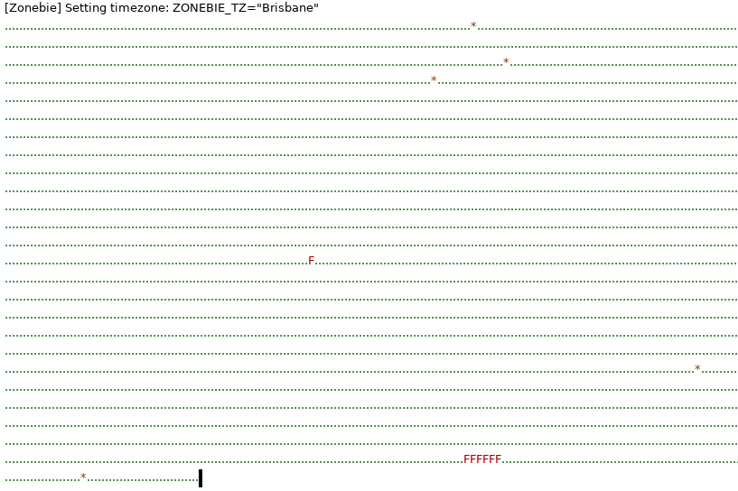

# Traditional CI container setup

Molly had tried a few months ago to run ci in buildkite - and reported everything except front end timeouts seemed to be working - there's also a forem ci pipeline in buildkite \(that keeps asking for an irreversible yaml transition\) that's probably tied to these

first-buildkite-pipeline [https://github.com/forem/forem/tree/mstruve/first-buildkite-pipeline](https://github.com/forem/forem/tree/mstruve/first-buildkite-pipeline)

try-containers-again [https://github.com/forem/forem/tree/mstruve/try-containers-again](https://github.com/forem/forem/tree/mstruve/try-containers-again) 

buildkite-ci [https://github.com/forem/forem/tree/mstruve/buildkite-ci](https://github.com/forem/forem/tree/mstruve/buildkite-ci)


Let's get one of these working \(I think I can use a local buildkite agent using the buildkite cli to execute them, otherwise the CI config should have an equivalent docker configuration\).

copy [https://raw.githubusercontent.com/forem/forem/f44bfccb82e33e0266100c21f6de0183442d051e/.buildkite/Dockerfile](https://raw.githubusercontent.com/forem/forem/f44bfccb82e33e0266100c21f6de0183442d051e/.buildkite/Dockerfile) into a local branch and call `Docker build .` to see what happens \(only change I made was to base off of the ruby:2.7.2 build 


```text
djuber@forem:~/src/forem-for-docker$ docker build .buildkite/
Sending build context to Docker daemon   5.12kB
Step 1/33 : FROM quay.io/forem/ruby:2.7.2
... SNIP ...

Step 18/33 : ENV DOCKERIZE_VERSION=v0.6.1
 ---> Using cache
 ---> 55641e4c5e18
Step 19/33 : RUN wget https://github.com/jwilder/dockerize/releases/download/"${DOCKERIZE_VERSION}"/dockerize-linux-amd64-"${DOCKERIZE_VERSION}".tar.gz     && tar -C /usr/local/bin -xzvf dockerize-linux-amd64-"${DOCKERIZE_VERSION}".tar.gz     && rm dockerize-linux-amd64-"${DOCKERIZE_VERSION}".tar.gz
 ---> Using cache
 ---> 1fe7857d3521
Step 20/33 : WORKDIR "${APP_HOME}"
 ---> Using cache
 ---> 659f209f360e
Step 21/33 : COPY ./.ruby-version "${APP_HOME}"
COPY failed: file not found in build context or excluded by .dockerignore: stat .ruby-version: file does not exist
djuber@forem:~/src/forem-for-docker$ ls -l .ruby-version 
-rw-r--r-- 1 djuber djuber 6 Mar 23 11:01 .ruby-version
djuber@forem:~/src/forem-for-docker$ cat .ruby-version 
2.7.2

# I think I needed instead 
$ docker build --file .buildkite/Dockerfile . -t testcontainer
```

That worked \(with the file option building from `.`\) - it looks like the coordination for this container requires postgresql up and running \(which docker-compose would have done for you\).

I'm still getting the carrierwave issue - and still not having this problem locally. Since molly wasn't crying about this 5 months ago, did something change with the carrierwave setup since then?

oh, I guess I had a typo - we're good - we're good! wow! whoa. this was stupid \(and I still don't know what happened to make this work correctly\).


```text
djuber@forem:~/src/forem-for-docker$ docker-compose --file=docker-compose-test.yml run -e RAILS_ENV=test -e DATABASE_URL_TEST="postgresql://forem:forem@db:5432/PracticalDeveloper_test"  rails bundle exec rspec spec/models/user_spec.rb   
WARNING: The KNAPSACK_PRO_TEST_SUITE_TOKEN_RSPEC variable is not set. Defaulting to a blank string.
WARNING: Found orphan containers (forem_bundle) for this project. If you removed or renamed this service in your compose file, you can run this command with the --remove-orphans flag to clean it up.
Starting forem_yarn                  ... done
Starting forem-for-docker_selenium_1 ... done
Starting forem_redis                 ... done
Starting forem_postgresql            ... done
Starting forem_elasticsearch         ... done
2021/03/29 20:44:11 Waiting for: http://selenium:4444
2021/03/29 20:44:11 Waiting for: tcp://db:5432
2021/03/29 20:44:11 Waiting for: http://elasticsearch:9200
2021/03/29 20:44:11 Waiting for: tcp://redis:6379
2021/03/29 20:44:11 Connected to tcp://db:5432
2021/03/29 20:44:11 Connected to tcp://redis:6379
2021/03/29 20:44:11 Received 200 from http://elasticsearch:9200
2021/03/29 20:44:11 Received 200 from http://selenium:4444
Running command:
bundle exec rspec spec/models/user_spec.rb
DEPRECATION WARNING: Devise::Models::Authenticatable::BLACKLIST_FOR_SERIALIZATION is deprecated! Use Devise::Models::Authenticatable::UNSAFE_ATTRIBUTES_FOR_SERIALIZATION instead. (called from const_get at /opt/apps/forem/vendor/cache/devise-0cd72a56f984/lib/devise/models.rb:90)
[Zonebie] Setting timezone: ZONEBIE_TZ="Chihuahua"
..........................................................................................
..........................................................................................
...................................

Finished in 34.94 seconds (files took 5.73 seconds to load)
217 examples, 0 failures

2021/03/29 20:44:52 Command finished successfully.
```

[https://github.com/forem/forem/commit/2dd87a52b1235bcdea78caefd6a680fc637c59e7](https://github.com/forem/forem/commit/2dd87a52b1235bcdea78caefd6a680fc637c59e7) running all of spec/ shows a _few_ failures - these might be systems tests - will let it finish before I decide what to do.


[https://gist.github.com/djuber/607f96332f7dc3ff7de8cf05301a1708](https://gist.github.com/djuber/607f96332f7dc3ff7de8cf05301a1708) okay - summary of issues

* can't find chrome \(all system/front-end tests require this for selenium\)
* seems like redis url is localhost:6379 and should not be \(a few tests use rpush or put feature flags in redis\) - might be a missing RPUSH\_URL env var that has been set to redis://redis:6379 in a subsequent commit
* admin should show last commit "some date" \(might be tied to the entrypoint.sh not finding git?\) - this looks like a one-off build process or execution order issue, rather than a problem with the container orchestration.

Next step was "add chrome to the build" since that seems like the biggest improvement if it works correctly.  Not sure if the build process was off \(at least the first time I confused the image tag and built a bogus name not referenced\) - I only shaved one failed spec.

[https://github.com/forem/forem/compare/master...djuber:djuber/spike-running-tests-in-docker](https://github.com/forem/forem/compare/master...djuber:djuber/spike-running-tests-in-docker) is the current progress as I get closer to clean. 

Note to self - adding rspec to entrypoint.sh for test makes running this easier but makes the output happen all at once \(less useful for watching impatiently\). `--format=documentation` might help \(the issue is the console width tracking that the pretty rspec binary tries to use to know how to fill the screen with green during progress formatting is nil for me in the container when writing to logs, so nothing is sent to output until a WARNING gets triggered \(then all pending results are flushed out\).

Okay - chrome is found \(chrome-headless was not enough\) but failures on the same tests because vcr/webmock doesn't know to permit through posts to selenium host

```text
       156.2) Failure/Error: VCR.turned_off { ex.run }
              
              WebMock::NetConnectNotAllowedError:
                Real HTTP connections are disabled. Unregistered request: POST http://selenium:4444/wd/hub/session with body '{"desiredCapabilities":{"browserName":"chrome","version":"","platform":"ANY","javascriptEnabled":true,"cssSelectorsEnabled":true,"takesScreenshot":false,"nativeEvents":false,"rotatable":false},"capabilities":{"firstMatch":[{"browserName":"chrome"}]}}' with headers {'Accept'=>'application/json', 'Accept-Encoding'=>'gzip;q=1.0,deflate;q=0.6,identity;q=0.3', 'Content-Length'=>'250', 'Content-Type'=>'application/json; charset=UTF-8', 'User-Agent'=>'selenium/3.142.7 (ruby linux)'}

```

90% sure I saw an "allowed hosts" commit that molly made in another branch that I need to bring in.

Indeed - in `spec/rails_helper.rb` there is an allow list, I added selenium:4444 to this \(which appears to have fixed a bulk of the system test failures\) - I'm still getting some issues with file uploads \(remote chrome and selenium &lt; 3.14 - might need to update the container in the docker compose\).

Not sure I understand the error - the container appears to be running 3.141.59 and should be "&gt; 3.14". Maybe the webdriver code is stale?

```text
/opt/selenium $java -jar selenium-server-standalone.jar 
14:00:25.954 INFO [GridLauncherV3.parse] - Selenium server version: 3.141.59, revision: e82be7d358
14:00:26.015 INFO [GridLauncherV3.lambda$buildLaunchers$3] - Launching a standalone Selenium Server on port 4444
2021-03-30 14:00:26.053:INFO::main: Logging initialized @256ms to org.seleniumhq.jetty9.util.log.StdErrLog
14:00:26.234 INFO [WebDriverServlet.<init>] - Initialising WebDriverServlet
14:00:26.306 INFO [SeleniumServer.boot] - Selenium Server is up and running on port 4444
```

Gemfile.lock shows selenium-webdriver is 3.142.7 - seems like also "&gt; 3.14" but I might be missing something...

```text
    selenium-webdriver (3.142.7)
      childprocess (>= 0.5, < 4.0)
      rubyzip (>= 1.2.2)
    webdrivers (4.6.0)
      nokogiri (~> 1.6)
      rubyzip (>= 1.3.0)
      selenium-webdriver (>= 3.0, < 4.0)
```

Time to re-read that Avdi  Grimm article on "end to end tests" [https://avdi.codes/rails-6-system-tests-from-top-to-bottom/](https://avdi.codes/rails-6-system-tests-from-top-to-bottom/) since I think I'm missing some piece of the action. Toss in [https://avdi.codes/run-rails-6-system-tests-in-docker-using-a-host-browser/](https://avdi.codes/run-rails-6-system-tests-in-docker-using-a-host-browser/) for extra credit and come back in 30 minutes after thinking for a bit.




### Slog continues

So I have a few questions hanging in the air

* why is selenium saying it is using an older version than the one in the container I've used? Is that just inconsistent error reporting based on the weird "lets make digits of pi because we're having so much fun" versioning scheme picked by the selenium maintainers?

```text
docker-compose --file=docker-compose-test.yml run -e RAILS_ENV=test -e DATABASE_URL_TEST="postgresql://forem:forem@db:5432/PracticalDeveloper_test"  rails bundle exec rake webdrivers:chromedriver:version 
WARNING: The KNAPSACK_PRO_TEST_SUITE_TOKEN_RSPEC variable is not set. Defaulting to a blank string.
Starting forem_yarn ... 
Starting forem_redis ... 
Starting forem_postgresql            ... 
Starting forem_elasticsearch         ... 
Starting forem-for-docker_selenium_1 ... 
2021/03/31 14:25:32 Waiting for: http://selenium:4444
2021/03/31 14:25:32 Waiting for: tcp://db:5432
2021/03/31 14:25:32 Waiting for: http://elasticsearch:9200
2021/03/31 14:25:32 Waiting for: tcp://redis:6379
2021/03/31 14:25:32 Connected to tcp://db:5432
2021/03/31 14:25:32 Connected to tcp://redis:6379
2021/03/31 14:25:32 Received 200 from http://elasticsearch:9200
2021/03/31 14:25:32 Received 200 from http://selenium:4444
DEPRECATION WARNING: Devise::Models::Authenticatable::BLACKLIST_FOR_SERIALIZATION is deprecated! Use Devise::Models::Authenticatable::UNSAFE_ATTRIBUTES_FOR_SERIALIZATION instead. (called from const_get at /opt/apps/forem/vendor/cache/devise-0cd72a56f984/lib/devise/models.rb:90)
2021-03-31 14:25:43 WARN Webdrivers No existing chromedriver found.
2021/03/31 14:25:43 Command finished successfully.
```

I did check to make sure I wasn't accidentally running chrome locally \(which seems specially weird since I had to _install_ chrome to get system tests to run\) - is the current setup "chromium browser in the ruby container, chrome driver in the selenium container, webdriver sends traffic over port 4444 to ask remote selenium to drive local chromium"? Does that make sense \(and why would we go through all of that setup pain?\).


