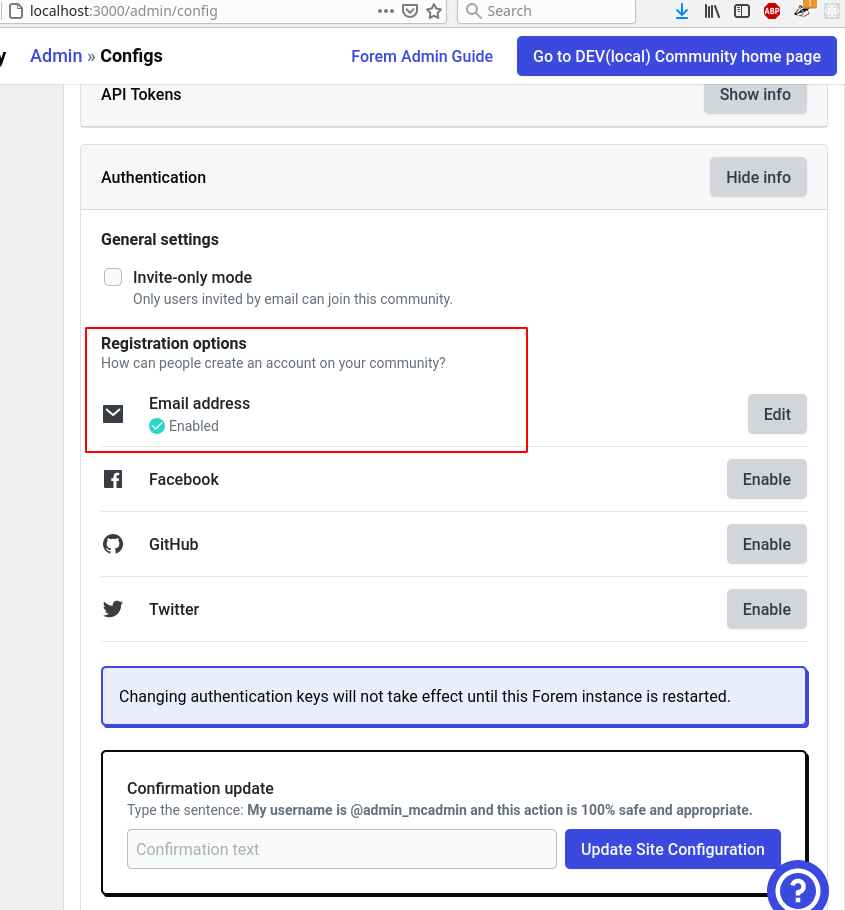
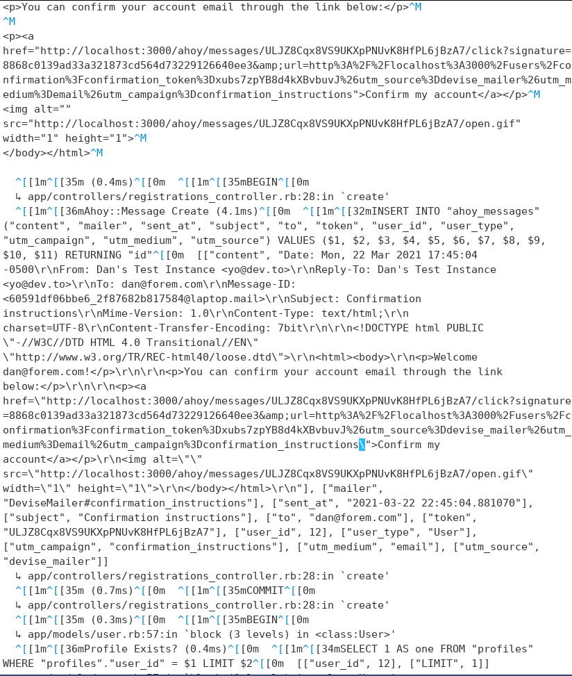

# User Setup in development

If you want to use email registration for local testing \(because you didn't setup api integrations with github, twitter, or facebook\), you can do this. If you _also_ don't have sendgrid api configured, you'll need to do a little trickery to get the registration confirmation \(as though you had gotten the email\).

You'll need to enable this in the configuration:

Fill in the registration with any email and pick a password.

look in `log/development.log` toward the end for the confirmation email - if you're looking at a large file jump to the end and search backward, one good key to search for is "Confirm my account" or "ahoy/messages/"

Grab the link \(should include `ahoy/messages/.../click?signature=` in it\) and open in your browser, then login with password and accept the code of conduct and terms of service and get to work.

