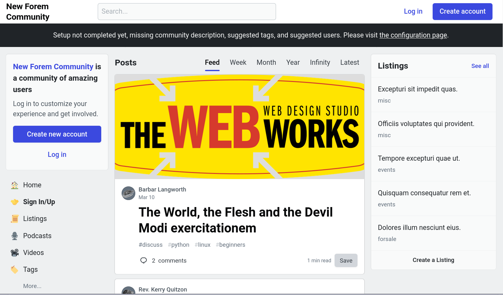
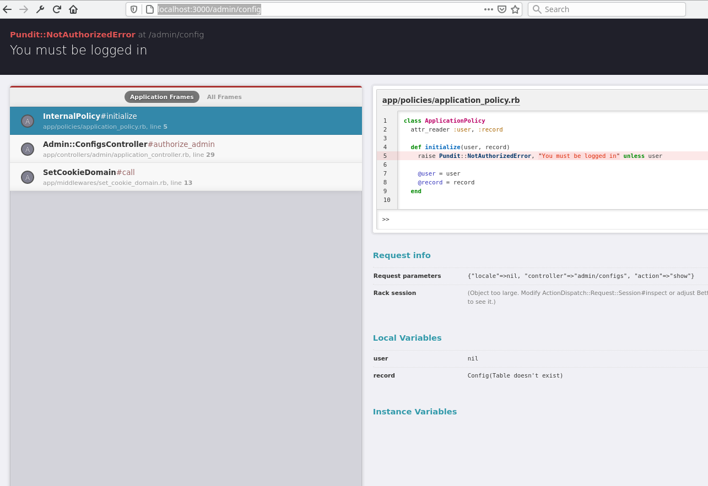
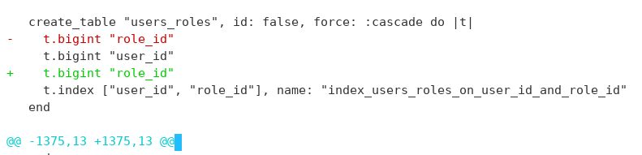
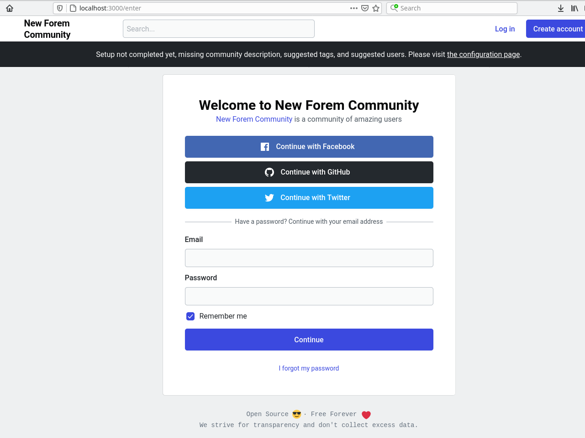
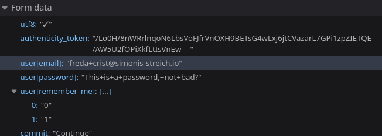
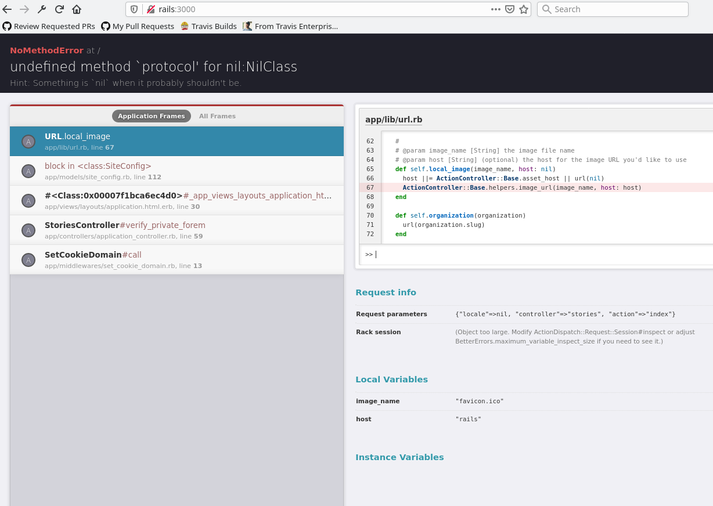

# Setting up a local test env with docker

## Setting up docker for local development


I don't think the local docker-compose development environment is fully functional - sidekiq and the console seem fine - but logging in  as a user \(kind of a core functionality\) was broken for me - I think I followed the right set of instructions and there's something off about the CSRF handling with docker hosted instances. If this is fixed the following should be considered my attempt, in March 2021, to set this up before I reached a breaking point - and continued successfully using the other instructions [without docker ](https://app.gitbook.com/@danuber/s/public-notes/without-docker)


I chose to use docker compose \(since that's the most straightforward approach and I didn't want to worry about installing ES\). I will assume you know how to checkout the forem repo and type docker commands, but should cover the rest of it explicitly here.


If you're running postgres or redis already on your host, this won't work out of the box \(docker-compose is set to expose redis on port 6379, so if you have that already running, you can't bind to that port and you'll see the redis container fail to start\) - I chose to stop these services as a work-around, I believe you could try changing the exposed ports but this might take some added rewiring \(I didn't try and can't say how many places these ports are expected\).


You have to copy the .env\_sample in the repo to .env \(it's in the instructions at [https://docs.forem.com/installation/containers/\#setting-up-forem](https://docs.forem.com/installation/containers/#setting-up-forem) but I skipped it the first time around and say an error page about nil protocol when the initial page was loading images\).

at this point `docker-compose up` will suffice to start the service - you should see an indication that [http://rails:3000/](http://rails:3000/) was checked as live. You can visit your testing instance at[ http://localhost:3000/](https://localhost:3000/) and should see some lorem ipsum text



There's a handy banner saying I need to configure the site, linking to [http://localhost:3000/admin/config](http://localhost:3000/admin/config) but when I visit that, I get a rails error page:



This doesn't seem totally wrong \(I'm _not_ logged in and I'm likely _not_ an authorized admin\) - we'll setup a user to login, and make them an admin, in the next steps.

\*\*\*\*

**Weirdness:** it looks like a sidekiq job runs every few seconds/minutes and chokes, need to look into this - might be an issue with the seed data. I did see some honeycomb or honeybadger warnings \(can't send failure reports to the 3rd party service\), I'll ignore those since I know I don't have an account setup with them \(and the .env file I copied from the sample had bogus keys for external services, see the [Backend Guide](https://docs.forem.com/backend/) discussion about setting up api integrations when you want thos things\).

```text
sidekiq_1        | 2021-03-11T00:08:44.716Z pid=18 tid=gvke class=Articles::ScoreCalcWorker jid=182396b04ec9e9012371f259 INFO: start
sidekiq_1        | 2021-03-11T00:08:44.744Z pid=18 tid=gvke class=Articles::ScoreCalcWorker jid=182396b04ec9e9012371f259 elapsed=0.028 INFO: fail
sidekiq_1        | 2021-03-11T00:08:44.744Z pid=18 tid=gvke WARN: {"context":"Job raised exception","job":{"retry":true,"queue":"medium_priority","lock":"until_executing","class":"Articles::ScoreCalcWorker","args":[8],"jid":"182396b04ec9e9012371f259","created_at":1615419949.3968022,"enqueued_at":1615421324.7159595,"error_message":"undefined method `<' for nil:NilClass","error_class":"NoMethodError","failed_at":1615419953.8786802,"retry_count":5,"retried_at":1615420610.2145078,"lock_timeout":0,"lock_ttl":null,"lock_prefix":"uniquejobs","lock_args":[8],"lock_digest":"uniquejobs:c378573e4d766e92b66d20e48fa48837"},"jobstr":"{\"retry\":true,\"queue\":\"medium_priority\",\"lock\":\"until_executing\",\"class\":\"Articles::ScoreCalcWorker\",\"args\":[8],\"jid\":\"182396b04ec9e9012371f259\",\"created_at\":1615419949.3968022,\"enqueued_at\":1615421324.7159595,\"error_message\":\"undefined method `<' for nil:NilClass\",\"error_class\":\"NoMethodError\",\"failed_at\":1615419953.8786802,\"retry_count\":5,\"retried_at\":1615420610.2145078}"}
sidekiq_1        | 2021-03-11T00:08:44.744Z pid=18 tid=gvke WARN: NoMethodError: undefined method `<' for nil:NilClass
sidekiq_1        | 2021-03-11T00:08:44.744Z pid=18 tid=gvke WARN: /opt/apps/forem/app/black_box/black_box.rb:69:in `social_auth_registration_recent?'
sidekiq_1        | /opt/apps/forem/app/black_box/black_box.rb:46:in `calculate_spaminess'
sidekiq_1        | /opt/apps/forem/app/models/article.rb:382:in `update_score'
```

**Weirdness 2**: Not immediately obvious how to connect to the database \(`bundle exec rails db` raises some errors because files in tmp/ are root owned, docker runs the webpack and rails processes as root inside the container and isn't doing user mode translation back to the user, so if you kept forem's code in ~/src/forem, then files in src/forem/tmp/ would be root owned\). Changing permissions means you just get the next problem, which is that bundled gem's built extensions against the container's ruby \(which appears to be quay.io/forem/forem:development - my local ruby had a slightly different version of glibc so I can't run bundle in the host while the containers are running\).

**Weirdness 3**: starting the docker-compose environment seems like it regenerated the db/schema.rb file, which appears to have the same content, but not the same order. I suggest reverting this file post-startup and before beginning work \(especially if that work includes a migration\).



## Using the console

As a backend engineer I spend a fair amount of time in the rails console, so getting one up and running makes sense. The docker-compose file sets up the environment for locally testing the web-app or running background jobs, but doesn't provide the interactive environment you get from the repl. In a "normal" or hosted rails environment, I would call `bundle exec rails console` to start pry or irb in the project, but see weirdness 2 above - bundle ran inside the containers and generated extensions for a slightly different linux than the one I'm running \(wrong glibc version was compiled against\). To work around this - I'll start a shell in the rails container and run a console there \(this is a layer of indirection you don't experience with a native execution\)

```text
 $ docker container exec -it forem_rails /bin/bash  
 ]0;@a3fd1a891eb4:/opt/apps/forem[root@a3fd1a891eb4 forem]# bundle exec rails console
 /usr/share/ruby/irb/completion.rb:18: warning: already initialized constant IRB::InputCompletor::ReservedWords
/usr/share/gems/gems/irb-1.2.6/lib/irb/completion.rb:18: warning: previous definition of ReservedWords was here
/usr/share/ruby/irb/completion.rb:39: warning: already initialized constant IRB::InputCompletor::BASIC_WORD_BREAK_CHARACTERS
/usr/share/gems/gems/irb-1.2.6/lib/irb/completion.rb:39: warning: previous definition of BASIC_WORD_BREAK_CHARACTERS was here
/usr/share/ruby/irb/completion.rb:41: warning: already initialized constant IRB::InputCompletor::CompletionProc
/usr/share/gems/gems/irb-1.2.6/lib/irb/completion.rb:41: warning: previous definition of CompletionProc was here
/usr/share/ruby/irb/completion.rb:268: warning: already initialized constant IRB::InputCompletor::PerfectMatchedProc
/usr/share/gems/gems/irb-1.2.6/lib/irb/completion.rb:268: warning: previous definition of PerfectMatchedProc was here
/usr/share/ruby/irb/completion.rb:294: warning: already initialized constant IRB::InputCompletor::Operators
/usr/share/gems/gems/irb-1.2.6/lib/irb/completion.rb:294: warning: previous definition of Operators was here
I, [2021-03-11T14:14:30.909342 #160]  INFO -- : Allowing 172.18.0.1 for BetterErrors and Web Console
Loading development environment (Rails 6.0.3.5)
[1] pry(main)>
```

You can ignore the ansi color codes in the prompt there, basically as a user I connect to docker, and inside the container I'm root, and once I've connected I run rails console as expected, and this starts a pry console. Since the seeds.rb file creates random users, and out of the box OAuth using github or facebook won't work \(facebook says invalid app id, twitter gives no visible response, github shows a 404 but probably is an invalid app id\) - I'm going to set a password for an existing user \(since I don't know yet how to enable creating users with password logins, this is a shortcut, the login page permits password login but there's no place to sign up with email + password only\).

I usually approach this by plucking the first random seed user out of the db, setting a password, and hoping for the best. I set `password=` and ask the record if it's `valid?` which is what it would do during persistence, it responds false so I check errors, and it looks like `password` _and_ `password_confirmation` must be present and matching, I'll send the same string as a `password_confirmation` and save the user.

```text
[3] pry(main)> u = User.first                         
  User Load (1.3ms)  SELECT "users"."id", "users"."name", "users"."twitter_username", "users"."github_username", "users"."created_at", "users"."updated_at", "users"."profile_image", "users"."email", "users"."encrypted_password", "users"."reset_password_token", "users"."reset_password_sent_at", "users"."remember_created_at", "users"."sign_in_count", "users"."current_sign_in_at", "users"."last_sign_in_at", "users"."current_sign_in_ip", "users"."last_sign_in_ip", "users"."confirmation_token", "users"."confirmed_at", "users"."confirmation_sent_at", "users"."unconfirmed_email", "users"."username", "users"."remember_token", "users"."secret", "users"."email_newsletter", "users"."email_comment_notifications", "users"."reputation_modifier", "users"."score", "users"."email_follower_notifications", "users"."signup_cta_variant", "users"."experience_level", "users"."onboarding_package_requested", "users"."github_created_at", "users"."twitter_created_at", "users"."twitter_following_count", "users"."twitter_followers_count", "users"."feed_url", "users"."articles_count", "users"."comments_count", "users"."old_username", "users"."old_old_username", "users"."reactions_count", "users"."email_unread_notifications", "users"."feed_mark_canonical", "users"."last_moderation_notification", "users"."last_notification_activity", "users"."stripe_id_code", "users"."checked_code_of_conduct", "users"."email_mention_notifications", "users"."following_tags_count", "users"."following_users_count", "users"."following_orgs_count", "users"."saw_onboarding", "users"."monthly_dues", "users"."display_sponsors", "users"."email_membership_newsletter", "users"."workshop_expiration", "users"."permit_adjacent_sponsors", "users"."email_digest_periodic", "users"."last_followed_at", "users"."badge_achievements_count", "users"."email_badge_notifications", "users"."email_connect_messages", "users"."editor_version", "users"."export_requested", "users"."exported_at", "users"."mobile_comment_notifications", "users"."feed_fetched_at", "users"."inbox_type", "users"."last_article_at", "users"."last_comment_at", "users"."profile_updated_at", "users"."github_repos_updated_at", "users"."rating_votes_count", "users"."config_theme", "users"."config_font", "users"."email_tag_mod_newsletter", "users"."email_community_mod_newsletter", "users"."inbox_guidelines", "users"."credits_count", "users"."spent_credits_count", "users"."unspent_credits_count", "users"."checked_terms_and_conditions", "users"."feed_referential_link", "users"."last_onboarding_page", "users"."mod_roundrobin_notifications", "users"."blocked_by_count", "users"."blocking_others_count", "users"."config_navbar", "users"."organization_info_updated_at", "users"."welcome_notifications", "users"."apple_created_at", "users"."apple_username", "users"."payment_pointer", "users"."display_announcements", "users"."subscribed_to_user_subscriptions_count", "users"."invitation_token", "users"."registered", "users"."registered_at", "users"."invitation_created_at", "users"."invitation_sent_at", "users"."invitation_accepted_at", "users"."invitation_limit", "users"."invited_by_type", "users"."invited_by_id", "users"."invitations_count", "users"."failed_attempts", "users"."unlock_token", "users"."locked_at", "users"."reaction_notifications", "users"."facebook_username", "users"."facebook_created_at", "users"."last_reacted_at", "users"."latest_article_updated_at" FROM "users" ORDER BY "users"."id" ASC LIMIT $1  [["LIMIT", 1]]
=> #<User id: 1, name: "Freda Crist", twitter_username: "crist_freda", github_username: nil, created_at: "2021-03-10 23:45:04", updated_at: "2021-03-10 23:45:26", profile_image: "f35ba69e-ca22-4ea6-9036-c3a95e3562c2.png", email: "freda+crist@simonis-streich.io", username: "crist_freda", secret: nil, email_newsletter: false, email_comment_notifications: false, reputation_modifier: 1.0, score: 0, email_follower_notifications: false, signup_cta_variant: nil, experience_level: nil, onboarding_package_requested: false, github_created_at: nil, twitter_created_at: nil, twitter_following_count: nil, twitter_followers_count: nil, feed_url: nil, articles_count: 1, comments_count: 3, old_username: nil, old_old_username: nil, reactions_count: 7, email_unread_notifications: true, feed_mark_canonical: false, last_moderation_notification: "2021-03-10 23:45:19", last_notification_activity: nil, stripe_id_code: nil, checked_code_of_conduct: false, email_mention_notifications: true, following_tags_count: 0, following_users_count: 0, following_orgs_count: 0, saw_onboarding: true, monthly_dues: 0, display_sponsors: true, email_membership_newsletter: false, workshop_expiration: nil, permit_adjacent_sponsors: true, email_digest_periodic: false, last_followed_at: nil, badge_achievements_count: 1, email_badge_notifications: true, email_connect_messages: true, editor_version: "v1", export_requested: false, exported_at: nil, mobile_comment_notifications: true, feed_fetched_at: "2017-01-01 05:00:00", inbox_type: "private", last_article_at: "2021-03-10 23:45:17", last_comment_at: "2021-03-10 23:45:25", profile_updated_at: "2017-01-01 05:00:00", github_repos_updated_at: "2017-01-01 05:00:00", rating_votes_count: 0, config_theme: "default", config_font: "default", email_tag_mod_newsletter: false, email_community_mod_newsletter: false, inbox_guidelines: nil, credits_count: 7, spent_credits_count: 0, unspent_credits_count: 7, checked_terms_and_conditions: false, feed_referential_link: true, last_onboarding_page: nil, mod_roundrobin_notifications: true, blocked_by_count: 0, blocking_others_count: 0, config_navbar: "default", organization_info_updated_at: "2021-03-10 23:45:11", welcome_notifications: true, apple_created_at: nil, apple_username: nil, payment_pointer: nil, display_announcements: true, subscribed_to_user_subscriptions_count: 0, registered: true, registered_at: "2021-03-10 23:45:03", reaction_notifications: true, facebook_username: nil, facebook_created_at: nil, last_reacted_at: nil, latest_article_updated_at: "2021-03-10 23:45:17">
[4] pry(main)> u.password
=> nil                   
[5] pry(main)> 
[6] pry(main)> u.password = 'This is a password, not bad?'
=> "This is a password, not bad?"
[7] pry(main)> u.valid?                                                          
  BanishedUser Exists? (1.2ms)  SELECT 1 AS one FROM "banished_users" WHERE "banished_users"."username" = $1 LIMIT $2  [["username", "crist_freda"], ["LIMIT", 1]]
  User Exists? (0.9ms)  SELECT 1 AS one FROM "users" LIMIT $1  [["LIMIT", 1]]
Unset ENV variable: TWITTER_KEY.
Unset ENV variable: TWITTER_SECRET.
Unset ENV variable: COMMUNITY_COPYRIGHT_START_YEAR.
Unset ENV variable: STRIPE_SECRET_KEY.
Unset ENV variable: STRIPE_PUBLISHABLE_KEY.
  SiteConfig Load (0.6ms)  SELECT var, value FROM "site_configs"
=> false

[8] pry(main)> u.errors                                                                                 
=> #<ActiveModel::Errors:0x00007fc542129940                                                             
 @base=
  #<User id: 1, name: "Freda Crist", twitter_username: "crist_freda", github_username: nil, created_at: "2021-03-10 23:45:04", updated_at: "2021-03-10 23:45:26", profile_image: "f35ba69e-ca22-4ea6-9036-c3a95e3562c2.png", email: "freda+crist@simonis-streich.io", username: "crist_freda", secret: nil, email_newsletter: false, email_comment_notifications: false, reputation_modifier: 1.0, score: 0, email_follower_notifications: false, signup_cta_variant: nil, experience_level: nil, onboarding_package_requested: false, github_created_at: nil, twitter_created_at: nil, twitter_following_count: nil, twitter_followers_count: nil, feed_url: nil, articles_count: 1, comments_count: 3, old_username: nil, old_old_username: nil, reactions_count: 7, email_unread_notifications: true, feed_mark_canonical: false, last_moderation_notification: "2021-03-10 23:45:19", last_notification_activity: nil, stripe_id_code: nil, checked_code_of_conduct: false, email_mention_notifications: true, following_tags_count: 0, following_users_count: 0, following_orgs_count: 0, saw_onboarding: true, monthly_dues: 0, display_sponsors: true, email_membership_newsletter: false, workshop_expiration: nil, permit_adjacent_sponsors: true, email_digest_periodic: false, last_followed_at: nil, badge_achievements_count: 1, email_badge_notifications: true, email_connect_messages: true, editor_version: "v1", export_requested: false, exported_at: nil, mobile_comment_notifications: true, feed_fetched_at: "2017-01-01 05:00:00", inbox_type: "private", last_article_at: "2021-03-10 23:45:17", last_comment_at: "2021-03-10 23:45:25", profile_updated_at: "2017-01-01 05:00:00", github_repos_updated_at: "2017-01-01 05:00:00", rating_votes_count: 0, config_theme: "default", config_font: "default", email_tag_mod_newsletter: false, email_community_mod_newsletter: false, inbox_guidelines: nil, credits_count: 7, spent_credits_count: 0, unspent_credits_count: 7, checked_terms_and_conditions: false, feed_referential_link: true, last_onboarding_page: nil, mod_roundrobin_notifications: true, blocked_by_count: 0, blocking_others_count: 0, config_navbar: "default", organization_info_updated_at: "2021-03-10 23:45:11", welcome_notifications: true, apple_created_at: nil, apple_username: nil, payment_pointer: nil, display_announcements: true, subscribed_to_user_subscriptions_count: 0, registered: true, registered_at: "2021-03-10 23:45:03", reaction_notifications: true, facebook_username: nil, facebook_created_at: nil, last_reacted_at: nil, latest_article_updated_at: "2021-03-10 23:45:17">,
 @details={:password=>[{:error=>"doesn't match password confirmation"}]},
 @messages={:password=>["doesn't match password confirmation"]}>
[9] pry(main)> u.password_confirmation = 'This is a password, not bad?'
=> "This is a password, not bad?"                                      

[11] pry(main)> u.valid?                       
  BanishedUser Exists? (0.6ms)  SELECT 1 AS one FROM "banished_users" WHERE "banished_users"."username" = $1 LIMIT $2  [["username", "crist_freda"], ["LIMIT", 1]]
=> true
[12] pry(main)> u.save                                               
   (0.5ms)  BEGIN
  BanishedUser Exists? (0.5ms)  SELECT 1 AS one FROM "banished_users" WHERE "banished_users"."username" = $1 LIMIT $2  [["username", "crist_freda"], ["LIMIT", 1]]
  User Update (2.1ms)  UPDATE "users" SET "updated_at" = $1, "encrypted_password" = $2 WHERE "users"."id" = $3  [["updated_at", "2021-03-11 14:23:22.622063"], ["encrypted_password", "$2a$10$czEde1Royi/DpQ3kArDY.O2ZzVx4E1tU3L50KJk9iqtlpzj.Ez.c2"], ["id", 1]]               
  Profile Load (0.7ms)  SELECT "profiles".* FROM "profiles" WHERE "profiles"."user_id" = $1 LIMIT $2  [["user_id", 1], ["LIMIT", 1]]
   (1.9ms)  COMMIT
=> true

[13] pry(main)> u.email                                                                     
=> "freda+crist@simonis-streich.io"                                                         
[14] pry(main)> u.password
=> "This is a password, not bad?"
```

At this point I have a user, email is shown at the bottom there, password is availabe on the in-memory user object, a freshly loaded object from the db would show nil again, since we don't normally expect unencrypted passwords to be available, let's _just_ double check we aren't exposing plaintext passwords by getting a fresh user copy of this user from the db:

```text
[17] pry(main)> u2 = User.find_by(email: u.email)
[18] pry(main)> u2.password
=> nil
```

## Logging In

Security fears allayed for the moment, see if we can login to the site. I click the "Log In" link on the page, and I get to a welcome page with non-functioning OAuth buttons and email + password form



So I put in my two magic strings, and I get a blank 200 page \(I would _normally_ have expected 302 redirect after post, this is unexpected, and presents as a blank page to me on what I assume was a successful login\)



Let's pop over to the shell session running docker-compose and see what the logs show - I see the POST with data that looks reasonable, and I see a 200 response \(from the Devise::SessionsController in this case\), followed by a request for serviceworker.js \(which I don't see in the network tab of the browser\) also giving a 200 - it looks like that's also a controller response and not a static asset \(just noting that for future investigation at this point\).

```text
rails_1          | Started POST "/users/sign_in" for 172.18.0.1 at 2021-03-11 14:45:46 +0000
rails_1          | Processing by Devise::SessionsController#create as HTML
rails_1          |   Parameters: {"utf8"=>"✓", "authenticity_token"=>"m8c++PaLNhnjJONKaODxWpK3BITecQQgdbsMlxePBoXEyS+9xAak72VYnn3ZdlncAA5s1PTXTSXmbhJhuUGnqA==", "user"=>{"email"=>"freda+crist@simonis-streich.io", "password"=>"[FILTERED]", "remember_me"=>"1"}, "commit"=>"Continue"}
rails_1          |   SiteConfig Load (0.5ms)  SELECT var, value FROM "site_configs"
rails_1          |   ↳ app/lib/url.rb:11:in `domain'
rails_1          | HTTP Origin header (http://localhost:3000) didn't match request.base_url (http://localhost:3000)
rails_1          | Completed 200 OK in 14ms (ActiveRecord: 0.5ms | Allocations: 4030)
rails_1          | 
rails_1          | 
rails_1          | Started GET "/serviceworker.js" for 172.18.0.1 at 2021-03-11 14:45:47 +0000
rails_1          | Processing by ServiceWorkerController#index as JS
rails_1          |   Parameters: {"locale"=>nil}
rails_1          |   SiteConfig Load (0.4ms)  SELECT var, value FROM "site_configs"
rails_1          |   ↳ app/controllers/concerns/verify_setup_completed.rb:25:in `public_send'
rails_1          |   Rendering service_worker/index.js.erb
rails_1          |   Rendered service_worker/index.js.erb (Duration: 0.1ms | Allocations: 24)
rails_1          | Completed 200 OK in 6ms (Views: 0.9ms | ActiveRecord: 0.4ms | Allocations: 3109)
rails_1          | 
rails_1          |
```

### Hypothesis 1: I did log in just fine, but the redirect is missing

To contradict that I just have to go back to [http://localhost:3000/](http://localhost:3000/) and see if I am logged in as the user, or seeing the Log In button, sure enough, the 200 POST response was a "failure" \(login forms are like this, redirect after successful post, redisplay the form when failed\) - I _think_ the issue here is the POST goes to /users/sign\_in but the login form is at /enter so there's no form to redisplay after post gives a 200. I'll consider this a failed login attempt.

### Hypothesis 2: Something was wrong with the request.

I do see a note about

```text
app/lib/url.rb:11:in `domain'
```

and a warning from the ActionController::RequestForgeryProtection about the Origin header not matching \(then giving two identical strings that don't match\).


### Hypothesis 3: Password login just isn't what I want

I guess the step I could follow here is to add a backend integration with twitter or github and use OAuth, but I'm pretty sure this _won't_ work with a localhost service on a private port from my desk with a private IP \(SAML definitely would not, there's no routable url for the callback to receive the response\). I do hear nice things about ngrok \(which exposes local services and ports on internet addresses via a tunnel\). The getting start page on [config-env](https://docs.forem.com/getting-started/config-env/) says:

only certain features require "real" keys, so you may be able to add them as you work

This is not a list of "must haves", might want to revisit that once I get this ironed out.

### Hypothesis 4: Read the docs

As usual, once you find the answer it's both obvious and humiliating, so I found a note [https://docs.forem.com/getting-started/db/\#default-admin-user](https://docs.forem.com/getting-started/db/#default-admin-user) suggesting I log in as admin@forem.local and see what happens.

```text
rails_1          | Started POST "/users/sign_in" for 172.18.0.1 at 2021-03-11 15:40:35 +0000
rails_1          |   ProfileField Load (0.9ms)  SELECT "profile_fields".* FROM "profile_fields" ORDER BY "profile_fields"."id" ASC LIMIT $1  [["LIMIT", 1000]]
rails_1          |   ↳ app/models/profile.rb:55:in `refresh_attributes!'
rails_1          |   User Exists? (1.6ms)  SELECT 1 AS one FROM "users" LIMIT $1  [["LIMIT", 1]]
rails_1          |   ↳ app/models/site_config.rb:25:in `<class:SiteConfig>'
rails_1          | Unset ENV variable: TWITTER_KEY.
rails_1          | Unset ENV variable: TWITTER_SECRET.
rails_1          | Unset ENV variable: COMMUNITY_COPYRIGHT_START_YEAR.
rails_1          | Unset ENV variable: STRIPE_SECRET_KEY.
rails_1          | Unset ENV variable: STRIPE_PUBLISHABLE_KEY.
rails_1          |   SiteConfig Load (0.6ms)  SELECT var, value FROM "site_configs"
rails_1          |   ↳ app/lib/url.rb:11:in `domain'
rails_1          | Unset ENV variable: RELEASE_FOOTPRINT.
rails_1          | Started GET "/serviceworker.js" for 172.18.0.1 at 2021-03-11 15:40:36 +0000
rails_1          |    (1.4ms)  SELECT "schema_migrations"."version" FROM "schema_migrations" ORDER BY "schema_migrations"."version" ASC
rails_1          | Processing by Devise::SessionsController#create as HTML
rails_1          |   Parameters: {"utf8"=>"✓", "authenticity_token"=>"0pVX+n2NQAK1xIfWDjLXFFACZaEKFKcoy8lN9eGCrZuNm0a/TwDS9DO4+uG/pH+SwrsN8SCy7i1YHFMDT0wMtg==", "user"=>{"email"=>"admin@forem.local", "password"=>"[FILTERED]", "remember_me"=>"1"}, "commit"=>"Continue"}
rails_1          | HTTP Origin header (http://localhost:3000) didn't match request.base_url (http://localhost:3000)  
rails_1          | Completed 200 OK in 4ms (ActiveRecord: 0.0ms | Allocations: 1651)
rails_1          | 
rails_1          | 
rails_1          |   ProfileField Load (0.9ms)  SELECT "profile_fields".* FROM "profile_fields" ORDER BY "profile_fields"."id" ASC LIMIT $1  [["LIMIT", 1000]]
rails_1          |   ↳ app/models/profile.rb:55:in `refresh_attributes!'
rails_1          |   User Exists? (0.8ms)  SELECT 1 AS one FROM "users" LIMIT $1  [["LIMIT", 1]]
rails_1          |   ↳ app/models/site_config.rb:25:in `<class:SiteConfig>'
rails_1          | Unset ENV variable: TWITTER_KEY.
rails_1          | Unset ENV variable: TWITTER_SECRET.
rails_1          | Unset ENV variable: COMMUNITY_COPYRIGHT_START_YEAR.
rails_1          | Unset ENV variable: STRIPE_SECRET_KEY.
rails_1          | Unset ENV variable: STRIPE_PUBLISHABLE_KEY.
rails_1          |   SiteConfig Load (0.4ms)  SELECT var, value FROM "site_configs"
rails_1          |   ↳ app/lib/url.rb:11:in `domain'
rails_1          | Unset ENV variable: RELEASE_FOOTPRINT.
rails_1          | Processing by ServiceWorkerController#index as JS
rails_1          |   Parameters: {"locale"=>nil}
rails_1          |   Rendering service_worker/index.js.erb
rails_1          |   Rendered service_worker/index.js.erb (Duration: 1.3ms | Allocations: 353)
rails_1          | Completed 200 OK in 163ms (Views: 6.0ms | ActiveRecord: 0.0ms | Allocations: 224032)              
rails_1          | 
rails_1          |
```

It looks like I still get the white screen at /users/sign\_in and a 200 response, and I still see the warning about the origin headers not matching the base url. Time to do a little more reading.

In the dot env I have these values \(default, feel correct, match both what I'm using to login and the warning I'm seeing about origin headers\):

```text
APP_DOMAIN="localhost:3000"
APP_PROTOCOL="http://"
```

### Hypothesis 5: Docker-compose isn't handling this correctly and local dev would work fine

So let's unwind our progress and stop docker, restart redis and postgres, and probably install ES, and chown all of vendor/ and tmp/ back to my user so the docker root owned files don't get in my way \(I may have to clobber vendor/cache if the extensions continue to give errors after bundle install\)

This page is already long so I'm going to move to [another one](https://app.gitbook.com/@danuber/s/public-notes/without-docker) for setting up a native local test env \(non-docker\).


## Getting back to this 

There was an issue in Forem with authentication that occurred about the same time as when I tried to get this running. So I'm taking a second pass at this \(since it dovetails nicely with work I'm about to do with CI, which expects containers anyway and may leverage the docker-compose configuration\). 

1. Since the issues I saw with extensions \(compiling against fedora's glibc but running on my debian host\) crashing leads me to think you really don't want both of these in the same tree, I'm recloning my repo into ~/src/forem-with-docker from my fork, this should allow the two vendored bundles \(and webpack generated files\) to not conflict, especially when coupled with issues around root owned files breaking local operations. This permits me to test either \(modulo service start/stop since the ports conflict, we probably don't need to expose everything on the default ports here\), and to not have to fight as much.
2. My initial goal is getting back up to a place where the site loads, and verifying user login. 



this contrasts with the behavior earlier "you should see an indication that [http://rails:3000/](http://rails:3000/) was checked as live" since I'm consistently getting a 500 - rechecking the setup instructions in case I skipped a step \(I copied .env\_sample to .env\)

I don't know what or why - I ended up deleting the containers \(I basically removed all containers and all images from my local docker service and re-ran `docker-compose up` and now see rails loads and sidekiq is doing it's thing\).

Next step would be to get the user creation/setup so I can test login.

