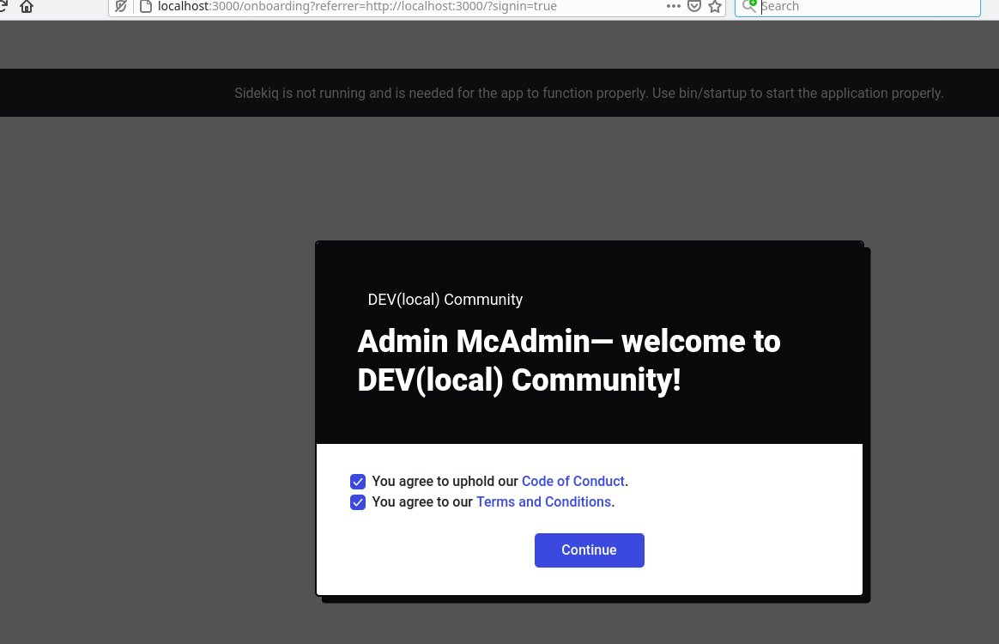

# Setting up a local test env without docker

First pass was [here](https://app.gitbook.com/@danuber/s/public-notes/) but hit some snags, this is a "refresh/reset/rest" attempt to login to a local dev instance of forem using the admin password.

### Recap

Trying to setup a local development environment following [https://docs.forem.com/getting-started/](https://docs.forem.com/getting-started/)

Initial attempt followed [https://docs.forem.com/installation/containers/](https://docs.forem.com/installation/containers/) but this pass will instead focus on [https://docs.forem.com/installation/linux/](https://docs.forem.com/installation/linux/)

Ideally this resolves the request header did not match site url issue I was seeing \(in which case that's an issue with the docker environment and should be fixed\). Worst case is I see the same forgery protection running locally outside of a container and have to resolve that.

## Install

I already had postgresql and redis installed locally, but those need to be started, `systemctl start postgresql` and `systemctl start redis_6379` seem to work for me locally \(if you're using another init system, or have other names for your services that's fine\). It's likely I'll want or need to setup postgres users for the database \(or trust all local connections, I'm not telling you which is better, trusting all local connections disables usually works well for me, but a lot of applications insist on sending passwords so you might want or need to add the user in the database url for the forem development env, I'll see what happens later\).

### Redis

Debian 10 has redis 5.0.3 \(which is what `redis-server --version` printed when I asked and what `apt search redis` suggested was current\), but forem requires redis 6.0 or higher. You could run this in a container or upgrade, I'll check the suggested link at [https://www.digitalocean.com/community/tutorial\_collections/how-to-install-and-secure-redis](https://www.digitalocean.com/community/tutorial_collections/how-to-install-and-secure-redis) since that's where Forem recommends you start. Sadly, this ends up using the obvious apt installable version so it's off to https://redis.io to download it. [https://download.redis.io/releases/redis-6.2.1.tar.gz](https://download.redis.io/releases/redis-6.2.1.tar.gz) is the latest stable version is the first thing I see, 6.2 &gt; 6.0 and we're off to the races.

```text
wget https://download.redis.io/releases/redis-6.2.1.tar.gz
tar xf redis-6.2.1.tar.gz
cd redis-6.2.1

# no configure script, redis just has a makefile, see Readme for install directions
# need to install libsystemd-dev to use this option but it looks right
make USE_SYSTEMD=yes 

    CC redis-benchmark.o
    LINK redis-benchmark
    INSTALL redis-check-rdb
    INSTALL redis-check-aof

Hint: It's a good idea to run 'make test' ;)

make[1]: Leaving directory '/data/src/redis-6.2.1/src'
djuber@laptop:~/src/redis-6.2.1$ make test
cd src && make test
make[1]: Entering directory '/data/src/redis-6.2.1/src'
Cleanup: may take some time... OK
Starting test server at port 21079
[ready]: 15684
...

# you might need sudo here to install to /usr/local/bin
make install
# you might have another service name
sudo systemctl restart redis_6379
```

Assuming all went well, we'll connect using `redis-cli` and ask [INFO](https://redis.io/commands/info) what the server version is

```text
djuber@laptop:~$ redis-cli "INFO" | head 
# Server
redis_version:6.2.1
redis_git_sha1:00000000
redis_git_dirty:0
redis_build_id:492cccd34166fb82
redis_mode:standalone
os:Linux 4.19.0-14-amd64 x86_64
arch_bits:64
multiplexing_api:epoll
atomicvar_api:c11-builtin
```

6.2.1 is running on port 6379 on localhost and all is well with redis.


### Elasticsearch

Elasticsearch is something that's a little controversial. Perhaps in response to AWS targetting their business, they recently made some modifications to their licensing terms for self-hosted applications permissible uses, causing community uproar and even more AWS targetting their business. We can focus on the minimum requirements here \(running just es in docker would not be a bad choice, as I already have a docker instance downloaded from the first pass\).

I'll follow the guide at [https://www.elastic.co/guide/en/elasticsearch/reference/7.5/targz.html\#install-linux](https://www.elastic.co/guide/en/elasticsearch/reference/7.5/targz.html#install-linux) but grab the oss version [https://artifacts.elastic.co/downloads/elasticsearch/elasticsearch-oss-7.5.2-linux-x86\_64.tar.gz](https://artifacts.elastic.co/downloads/elasticsearch/elasticsearch-oss-7.5.2-linux-x86_64.tar.gz) since that's what [https://docs.forem.com/installation/linux/](https://docs.forem.com/installation/linux/) points out.

This is a long running service, running it in a shell like this might be a bother if you're not in the habit of letting shell sessions accumulate. tmux or screen or some other process manager might make sense, but I'll leave it in a shell session \(in emacs I can just name this `*elasticsearch process*` and leave it alone. For the time being I'll leave the default settings in place \(if java uses too much memory or ES starts to fail because of resource constraints it would be time to adjust that, but I'll hope for the best for now\):

```text
djuber@laptop:~/Downloads$ wget https://artifacts.elastic.co/downloads/elasticsearch/elasticsearch-oss-7.5.2-linux-x86_64.tar.gz
--2021-03-11 10:27:07--  https://artifacts.elastic.co/downloads/elasticsearch/elasticsearch-oss-7.5.2-linux-x86_64.tar.gz
Resolving artifacts.elastic.co (artifacts.elastic.co)... 34.120.127.130, 2600:1901:0:1d7::
Connecting to artifacts.elastic.co (artifacts.elastic.co)|34.120.127.130|:443... connected.
HTTP request sent, awaiting response... 200 OK
Length: 217036266 (207M) [application/x-gzip]
Saving to: ‘elasticsearch-oss-7.5.2-linux-x86_64.tar.gz’

elasticsearch-oss-7.5.2-linux-x86_64.tar 100%[================================================================================>] 206.98M  18.3MB/s    in 14s     

2021-03-11 10:27:21 (14.7 MB/s) - ‘elasticsearch-oss-7.5.2-linux-x86_64.tar.gz’ saved [217036266/217036266]


djuber@laptop:~/Downloads$ tar xf elasticsearch-oss-7.5.2-linux-x86_64.tar.gz 
djuber@laptop:~/Downloads$ cd elasticsearch-7.5.2
djuber@laptop:~/Downloads/elasticsearch-7.5.2$ bin/elasticsearch
OpenJDK 64-Bit Server VM warning: Option UseConcMarkSweepGC was deprecated in version 9.0 and will likely be removed in a future release.
[2021-03-11T10:28:56,882][INFO ][o.e.e.NodeEnvironment    ] [laptop] using [1] data paths, mounts [[/data (/dev/mapper/vg--data-lv--data)]], net usable_space [1.7tb], net total_space [1.8tb], types [xfs]
[2021-03-11T10:28:56,887][INFO ][o.e.e.NodeEnvironment    ] [laptop] heap size [989.8mb], compressed ordinary object pointers [true]
[2021-03-11T10:28:56,892][INFO ][o.e.n.Node               ] [laptop] node name [laptop], node ID [DH3GJ6JoQXOE3rC1iDaqPw], cluster name [elasticsearch]
[2021-03-11T10:28:56,893][INFO ][o.e.n.Node               ] [laptop] version[7.5.2], pid[28037], build[oss/tar/8bec50e1e0ad29dad5653712cf3bb580cd1afcdf/2020-01-15T12:11:52.313576Z], OS[Linux/4.19.0-14-amd64/amd64], JVM[AdoptOpenJDK/OpenJDK 64-Bit Server VM/13.0.1/13.0.1+9]
[2021-03-11T10:28:56,894][INFO ][o.e.n.Node               ] [laptop] JVM home [/data/Downloads/elasticsearch-7.5.2/jdk]

# lots of diagnostic logging... finally:

[2021-03-11T10:29:07,407][INFO ][o.e.h.AbstractHttpServerTransport] [laptop] publish_address {127.0.0.1:9200}, bound_addresses {[::1]:9200}, {127.0.0.1:9200}
[2021-03-11T10:29:07,408][INFO ][o.e.n.Node               ] [laptop] started
[2021-03-11T10:29:07,469][INFO ][o.e.g.GatewayService     ] [laptop] recovered [0] indices into cluster_state
```

Assuming all went well, we can hit the port 9200 with curl and get the expected healthcheck response

```text
$ curl -H 'Content-type: application/json' http://localhost:9200/
{
  "name" : "laptop",
  "cluster_name" : "elasticsearch",
  "cluster_uuid" : "m2JZ5s0bQ6iHd3kxaEoagg",
  "version" : {
    "number" : "7.5.2",
    "build_flavor" : "oss",
    "build_type" : "tar",
    "build_hash" : "8bec50e1e0ad29dad5653712cf3bb580cd1afcdf",
    "build_date" : "2020-01-15T12:11:52.313576Z",
    "build_snapshot" : false,
    "lucene_version" : "8.3.0",
    "minimum_wire_compatibility_version" : "6.8.0",
    "minimum_index_compatibility_version" : "6.0.0-beta1"
  },
  "tagline" : "You Know, for Search"
}
```

### Node/nvm/yarn

I think I fall into the "older system node" category here and I also want to install nvm

```text
djuber@laptop:~/src/forem$ nvm
bash: nvm: command not found
djuber@laptop:~/src/forem$ node --version
v10.15.0
```

Grabbing nvm from [https://github.com/nvm-sh/nvm](https://github.com/nvm-sh/nvm) suggests download from the internet and pipe to bash. This isn't the most secure idea, but assuming we trust github not to attack us \(I do\), and the nvm-sh user not to have been compromised \(I probably shouldn't, there have been a lot of these hijackings and they're pernicious\) we can follow their instructions:

```text
djuber@laptop:~/src/forem$ curl -o- https://raw.githubusercontent.com/nvm-sh/nvm/v0.37.2/install.sh | bash
  % Total    % Received % Xferd  Average Speed   Time    Time     Time  Current
                                 Dload  Upload   Total   Spent    Left  Speed
100 13527  100 13527    0     0   116k      0 --:--:-- --:--:-- --:--:--  116k
=> Downloading nvm from git to '/home/djuber/.nvm'
=> Cloning into '/home/djuber/.nvm'...
remote: Enumerating objects: 333, done.
remote: Counting objects: 100% (333/333), done.
remote: Compressing objects: 100% (283/283), done.
remote: Total 333 (delta 38), reused 150 (delta 25), pack-reused 0
Receiving objects: 100% (333/333), 177.15 KiB | 3.62 MiB/s, done.
Resolving deltas: 100% (38/38), done.
=> Compressing and cleaning up git repository

=> nvm source string already in /home/djuber/.bashrc
=> bash_completion source string already in /home/djuber/.bashrc
=> You currently have modules installed globally with `npm`. These will no
=> longer be linked to the active version of Node when you install a new node
=> with `nvm`; and they may (depending on how you construct your `$PATH`)
=> override the binaries of modules installed with `nvm`:

/usr/local/lib
├── esy@0.6.2
├── nom@0.0.3
├── reason-standard@0.1.0-alpha.1
└── yarn@1.22.4
=> If you wish to uninstall them at a later point (or re-install them under your
=> `nvm` Nodes), you can remove them from the system Node as follows:

     $ nvm use system
     $ npm uninstall -g a_module

=> Close and reopen your terminal to start using nvm or run the following to use it now:

export NVM_DIR="$HOME/.nvm"
[ -s "$NVM_DIR/nvm.sh" ] && \. "$NVM_DIR/nvm.sh"  # This loads nvm
[ -s "$NVM_DIR/bash_completion" ] && \. "$NVM_DIR/bash_completion"  # This loads nvm bash_completion


# do what the instructions said, either start a new shell or load the environment


# this finds the preferred node version in .nvmrc - nvm use will load that in the future
djuber@laptop:~/src/forem$ nvm install
Found '/home/djuber/src/forem/.nvmrc' with version <14.14>
Downloading and installing node v14.14.0...
Downloading https://nodejs.org/dist/v14.14.0/node-v14.14.0-linux-x64.tar.xz...
```

Yarn is ready to install _after_ nvm builds node 14 for us. The install instructions at [https://classic.yarnpkg.com/en/docs/install\#debian-stable](https://classic.yarnpkg.com/en/docs/install#debian-stable) look a little scary \(there's a note that this is all old and deprecated and the new yarn 2.0 install instructions are elsewhere\). As a sanity check I looked at the .[yarnrc](https://github.com/forem/forem/blob/master/.yarnrc) file in my forem directory with the yarn-path, it points to .yarn/releases/yarn-1.22.5.js for me, so I'm pretty sure either my system, or the docker system, was using yarn 1 and not 2 and I'll continue doing that. Since I see that's checked into forem's repo, I'm pretty sure I didn't put it there and that's an expected version for the system \(which removes a lot of doubt I might have had here\).

Just to double check the `node` command uses the right nvm provided binary now

```text
djuber@laptop:~/src/forem$ node --version
v14.14.0
djuber@laptop:~/src/forem$ which npm
/home/djuber/.nvm/versions/node/v14.14.0/bin/npm

djuber@laptop:~/src/forem$ npm install --global yarn

> yarn@1.22.10 preinstall /home/djuber/.nvm/versions/node/v14.14.0/lib/node_modules/yarn
> :; (node ./preinstall.js > /dev/null 2>&1 || true)

/home/djuber/.nvm/versions/node/v14.14.0/bin/yarnpkg -> /home/djuber/.nvm/versions/node/v14.14.0/lib/node_modules/yarn/bin/yarn.js
/home/djuber/.nvm/versions/node/v14.14.0/bin/yarn -> /home/djuber/.nvm/versions/node/v14.14.0/lib/node_modules/yarn/bin/yarn.js
+ yarn@1.22.10
added 1 package in 0.76s


   ╭───────────────────────────────────────────────────────────────╮
   │                                                               │
   │      New major version of npm available! 6.14.4 → 7.6.2       │
   │   Changelog: https://github.com/npm/cli/releases/tag/v7.6.2   │
   │               Run npm install -g npm to update!               │
   │                                                               │
   ╰───────────────────────────────────────────────────────────────╯

djuber@laptop:~/src/forem$ yarn --version
1.22.5
```

I'll ignore the npm upgrade warning \(it's really regrettable that this happens immediately after installing node, and not important for what we're doing here\).

### rbenv

Fortunately this was already set up \(you might have rbenv but not the right version if you worked with another project, `rbenv install 2.7.2` would fix that\)

```text
# this is using the .ruby-version file to select automatically
djuber@laptop:~/src/forem$ rbenv which ruby
/home/djuber/.rbenv/versions/2.7.2/bin/ruby
```

## Setup Forem

[https://docs.forem.com/installation/linux/\#installing-forem](https://docs.forem.com/installation/linux/#installing-forem) suggests copy env \(done\) and run bin/setup. At this point I got stung with the build extensions for the wrong linux and nuked the content of vendor and re-ran bundle.

It looks like the setup script did not choke creating a db so my postgresql setup is "permissive" or functional \(which saves a trip to `pg_hba.conf` or a call to `createuser`\)

```text
bin/setup
# lots of things, checks bundle, installs foreman, creates and seeds the db
```

Checking the local postgres instance I can see both the dev and test instances were populated:

```text
psql (13.2 (Debian 13.2-1.pgdg90+1), server 11.11 (Debian 11.11-1.pgdg90+1))
Type "help" for help.

djuber=# \l
                                              List of databases
            Name            |      Owner      | Encoding |   Collate   |    Ctype    |   Access privileges   
----------------------------+-----------------+----------+-------------+-------------+-----------------------
 Forem_development          | djuber          | UTF8     | en_US.UTF-8 | en_US.UTF-8 | 
 Forem_test                 | djuber          | UTF8     | en_US.UTF-8 | en_US.UTF-8 |
```

## Run it

```text
djuber@laptop:~/src/forem$ bundle exec rails server
=> Booting Puma
=> Rails 6.0.3.5 application starting in development 
=> Run `rails server --help` for more startup options
[4260] Puma starting in cluster mode...
[4260] * Puma version: 5.2.2 (ruby 2.7.2-p137) ("Fettisdagsbulle")
```

navigate to [http://localhost:3000/](http://localhost:3000/) \(looks good - different lorem  ipsum text articles but still looks like a Forem\)

Login as admin@forem.local using the password `password` \(from the seed data\) and now I get redirected to "onboarding" - success. I guess that means the problems I had were docker specific \(and possibly docker-compose is not fully working or has gotten out of sync with what the native environment is doing\).



